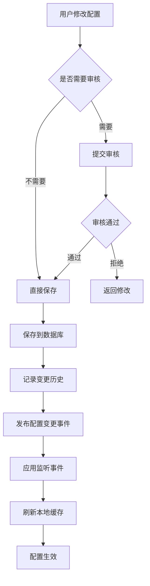

# LoadUp Config 配置管理模块 - 设计方案

> **版本**: v1.0  
> **创建日期**: 2026-02-28  
> **模块代号**: loadup-modules-config  
> **优先级**: 🔴 P0

## 📋 目录

- [1. 模块概述](#1-模块概述)
- [2. 功能设计](#2-功能设计)
- [3. 架构设计](#3-架构设计)
- [4. 数据模型设计](#4-数据模型设计)
- [5. API 设计](#5-api-设计)
- [6. 技术实现](#6-技术实现)
- [7. 安全设计](#7-安全设计)
- [8. 性能优化](#8-性能优化)
- [9. 测试方案](#9-测试方案)
- [10. 实施计划](#10-实施计划)

---

## 1. 模块概述

### 1.1 业务价值

Config 配置管理模块是整个系统的基础支撑模块，提供：

- **系统参数管理**: 运行时可修改的系统配置
- **数据字典管理**: 业务枚举值的集中管理
- **配置版本控制**: 配置变更历史追溯和回滚
- **配置热更新**: 无需重启即可生效的配置变更
- **配置分发**: 配置变更的事件通知机制

### 1.2 核心特性

| 特性 | 说明 | 优先级 |
|-----|------|--------|
| 系统参数管理 | key-value 配置，支持多种数据类型 | P0 |
| 数据字典管理 | 分类字典、级联字典 | P0 |
| 配置热更新 | 基于事件机制的自动刷新 | P0 |
| 配置加密 | 敏感配置加密存储 | P1 |
| 配置版本管理 | 变更历史和回滚 | P1 |
| 配置导入导出 | JSON/YAML 格式 | P2 |
| 配置审计 | 变更日志记录 | P1 |

### 1.3 非功能需求

- **性能**: 配置读取 < 10ms (本地缓存)
- **可用性**: 99.9%+
- **并发**: 支持 10000+ QPS 查询
- **数据一致性**: 最终一致性
- **扩展性**: 支持自定义配置类型

---

## 2. 功能设计

### 2.1 系统参数管理

#### 功能列表

```
系统参数管理
├─ 参数分组
│  ├─ 按业务模块分组 (system/security/upload/email...)
│  └─ 分组树形结构
├─ 参数类型
│  ├─ STRING (字符串)
│  ├─ INTEGER (整数)
│  ├─ LONG (长整数)
│  ├─ DOUBLE (浮点数)
│  ├─ BOOLEAN (布尔值)
│  └─ JSON (JSON对象/数组)
├─ 参数管理
│  ├─ 新增参数
│  ├─ 修改参数值
│  ├─ 删除参数
│  └─ 批量操作
└─ 参数查询
   ├─ 按 key 查询
   ├─ 按分组查询
   └─ 模糊搜索
```

#### 核心场景

**场景1: 上传文件大小限制**
```java
// 配置定义
key: upload.max-file-size
value: 10485760
type: LONG
category: upload
description: 文件上传大小限制(字节)
editable: true
```

**场景2: 邮件服务配置**
```java
// 配置定义
key: email.smtp.config
value: {"host":"smtp.qq.com","port":587,"username":"admin@example.com"}
type: JSON
category: email
encrypted: true
```

### 2.2 数据字典管理

#### 功能列表

```
数据字典管理
├─ 字典类型
│  ├─ 新增类型
│  ├─ 修改类型
│  ├─ 删除类型
│  └─ 启用/停用
├─ 字典项
│  ├─ 新增字典项
│  ├─ 修改字典项
│  ├─ 删除字典项
│  ├─ 排序
│  └─ 启用/停用
├─ 级联字典
│  ├─ 父子关系定义
│  └─ 树形结构
└─ 字典查询
   ├─ 按类型查询
   ├─ 级联查询
   └─ 缓存优化
```

#### 核心场景

**场景1: 用户状态字典**
```java
// 字典类型
code: user_status
name: 用户状态
system: true

// 字典项
{label: "正常", value: "1", sort: 1},
{label: "停用", value: "0", sort: 2},
{label: "锁定", value: "2", sort: 3}
```

**场景2: 地区级联字典**
```java
// 省份
{label: "北京市", value: "110000", parentValue: null}
// 城市
{label: "北京市", value: "110100", parentValue: "110000"}
// 区县
{label: "东城区", value: "110101", parentValue: "110100"}
```

### 2.3 配置变更管理

#### 变更流程



---

## 3. 架构设计

### 3.1 分层架构 (COLA 4.0)

```
loadup-modules-config/
├─ loadup-modules-config-client/          # 客户端API
│  └─ src/main/java/
│     └─ io/github/loadup/config/client/
│        ├─ api/
│        │  ├─ ConfigService.java         # 配置查询API
│        │  └─ DictService.java           # 字典查询API
│        └─ dto/
│           ├─ ConfigDTO.java
│           └─ DictDTO.java
│
├─ loadup-modules-config-adapter/         # 适配层
│  └─ src/main/java/
│     └─ io/github/loadup/config/adapter/
│        ├─ web/                          # REST API
│        │  ├─ ConfigController.java
│        │  └─ DictController.java
│        ├─ event/                        # 事件监听
│        │  └─ ConfigChangeListener.java
│        └─ dto/                          # DTO转换
│           ├─ ConfigRequest.java
│           └─ ConfigResponse.java
│
├─ loadup-modules-config-app/             # 应用层
│  └─ src/main/java/
│     └─ io/github/loadup/config/app/
│        ├─ command/                      # 命令处理
│        │  ├─ CreateConfigCmd.java
│        │  └─ UpdateConfigCmd.java
│        ├─ query/                        # 查询处理
│        │  ├─ GetConfigQry.java
│        │  └─ ListDictQry.java
│        └─ executor/                     # 执行器
│           ├─ ConfigCommandExecutor.java
│           └─ ConfigQueryExecutor.java
│
├─ loadup-modules-config-domain/          # 领域层
│  └─ src/main/java/
│     └─ io/github/loadup/config/domain/
│        ├─ config/                       # 配置聚合
│        │  ├─ Config.java               # 配置实体
│        │  ├─ ConfigValue.java          # 值对象
│        │  └─ ConfigRepository.java     # 仓储接口
│        ├─ dict/                         # 字典聚合
│        │  ├─ DictType.java
│        │  ├─ DictItem.java
│        │  └─ DictRepository.java
│        ├─ history/                      # 变更历史
│        │  └─ ConfigHistory.java
│        └─ event/                        # 领域事件
│           └─ ConfigChangedEvent.java
│
├─ loadup-modules-config-infrastructure/   # 基础设施层
│  └─ src/main/java/
│     └─ io/github/loadup/config/infra/
│        ├─ repository/                   # 仓储实现
│        │  ├─ ConfigRepositoryImpl.java
│        │  └─ DictRepositoryImpl.java
│        ├─ mapper/                       # MyBatis Mapper
│        │  ├─ ConfigMapper.java
│        │  └─ DictMapper.java
│        ├─ cache/                        # 缓存实现
│        │  └─ ConfigCacheManager.java
│        ├─ encrypt/                      # 加密实现
│        │  └─ ConfigEncryptor.java
│        └─ event/                        # 事件发布
│           └─ ConfigEventPublisher.java
│
└─ loadup-modules-config-starter/         # 自动配置
   └─ src/main/java/
      └─ io/github/loadup/config/starter/
         ├─ ConfigAutoConfiguration.java
         ├─ ConfigProperties.java
         └─ ConfigClientBeanProcessor.java
```

### 3.2 核心组件

#### 3.2.1 配置客户端

```java
/**
 * 配置客户端 - 供业务代码使用
 */
@Component
public class ConfigClient {
    
    private final ConfigCacheManager cacheManager;
    private final ConfigRepository repository;
    
    /**
     * 获取配置值（泛型支持）
     */
    public <T> T getValue(String key, Class<T> type) {
        return getValue(key, type, null);
    }
    
    /**
     * 获取配置值（带默认值）
     */
    public <T> T getValue(String key, Class<T> type, T defaultValue) {
        // 1. 从缓存获取
        Config config = cacheManager.get(key);
        if (config == null) {
            // 2. 从数据库加载
            config = repository.findByKey(key)
                .orElse(null);
            if (config != null) {
                cacheManager.put(key, config);
            }
        }
        
        // 3. 类型转换
        if (config != null) {
            return config.getValue().convertTo(type);
        }
        
        return defaultValue;
    }
    
    /**
     * 监听配置变更
     */
    public void listen(String key, ConfigChangeListener listener) {
        // 注册监听器
    }
}
```

#### 3.2.2 配置注解支持

```java
/**
 * 配置值注入注解
 */
@Target(ElementType.FIELD)
@Retention(RetentionPolicy.RUNTIME)
public @interface ConfigValue {
    /**
     * 配置键
     */
    String value();
    
    /**
     * 默认值
     */
    String defaultValue() default "";
    
    /**
     * 是否自动刷新
     */
    boolean autoRefresh() default true;
}

// 使用示例
@Component
public class UploadService {
    
    @ConfigValue("upload.max-file-size")
    private Long maxFileSize;  // 自动注入并刷新
    
    public void uploadFile(MultipartFile file) {
        if (file.getSize() > maxFileSize) {
            throw new BusinessException("文件过大");
        }
    }
}
```

---

## 4. 数据模型设计

### 4.1 数据库表设计

#### 4.1.1 系统参数表 (config_item)

```sql
CREATE TABLE config_item (
    id VARCHAR(64) NOT NULL COMMENT '主键',
    config_key VARCHAR(200) NOT NULL COMMENT '配置键',
    config_value TEXT COMMENT '配置值',
    value_type VARCHAR(20) NOT NULL DEFAULT 'STRING' COMMENT '值类型: STRING/INTEGER/LONG/DOUBLE/BOOLEAN/JSON',
    category VARCHAR(50) NOT NULL DEFAULT 'default' COMMENT '分类',
    description VARCHAR(500) COMMENT '描述',
    editable BOOLEAN NOT NULL DEFAULT TRUE COMMENT '是否可编辑',
    encrypted BOOLEAN NOT NULL DEFAULT FALSE COMMENT '是否加密',
    system_defined BOOLEAN NOT NULL DEFAULT FALSE COMMENT '是否系统定义',
    sort_order INT NOT NULL DEFAULT 0 COMMENT '排序',
    enabled BOOLEAN NOT NULL DEFAULT TRUE COMMENT '是否启用',
    created_by VARCHAR(64) COMMENT '创建人',
    created_at DATETIME NOT NULL DEFAULT CURRENT_TIMESTAMP COMMENT '创建时间',
    updated_by VARCHAR(64) COMMENT '更新人',
    updated_at DATETIME NOT NULL DEFAULT CURRENT_TIMESTAMP ON UPDATE CURRENT_TIMESTAMP COMMENT '更新时间',
    PRIMARY KEY (id),
    UNIQUE KEY uk_config_key (config_key),
    KEY idx_category (category),
    KEY idx_enabled (enabled)
) ENGINE=InnoDB DEFAULT CHARSET=utf8mb4 COLLATE=utf8mb4_unicode_ci COMMENT='系统参数配置表';

-- 初始数据
INSERT INTO config_item (id, config_key, config_value, value_type, category, description, system_defined) VALUES
('1', 'system.name', 'LoadUp Framework', 'STRING', 'system', '系统名称', TRUE),
('2', 'upload.max-file-size', '10485760', 'LONG', 'upload', '文件上传大小限制(字节)', FALSE),
('3', 'security.password-expire-days', '90', 'INTEGER', 'security', '密码过期天数', FALSE),
('4', 'cache.default-ttl', '3600', 'INTEGER', 'cache', '默认缓存过期时间(秒)', FALSE);
```

#### 4.1.2 数据字典类型表 (dict_type)

```sql
CREATE TABLE dict_type (
    id VARCHAR(64) NOT NULL COMMENT '主键',
    dict_code VARCHAR(100) NOT NULL COMMENT '字典编码',
    dict_name VARCHAR(200) NOT NULL COMMENT '字典名称',
    description VARCHAR(500) COMMENT '描述',
    system_defined BOOLEAN NOT NULL DEFAULT FALSE COMMENT '是否系统定义',
    sort_order INT NOT NULL DEFAULT 0 COMMENT '排序',
    enabled BOOLEAN NOT NULL DEFAULT TRUE COMMENT '是否启用',
    created_by VARCHAR(64) COMMENT '创建人',
    created_at DATETIME NOT NULL DEFAULT CURRENT_TIMESTAMP COMMENT '创建时间',
    updated_by VARCHAR(64) COMMENT '更新人',
    updated_at DATETIME NOT NULL DEFAULT CURRENT_TIMESTAMP ON UPDATE CURRENT_TIMESTAMP COMMENT '更新时间',
    PRIMARY KEY (id),
    UNIQUE KEY uk_dict_code (dict_code),
    KEY idx_enabled (enabled)
) ENGINE=InnoDB DEFAULT CHARSET=utf8mb4 COLLATE=utf8mb4_unicode_ci COMMENT='数据字典类型表';

-- 初始数据
INSERT INTO dict_type (id, dict_code, dict_name, system_defined) VALUES
('1', 'user_status', '用户状态', TRUE),
('2', 'gender', '性别', TRUE),
('3', 'yes_no', '是否', TRUE);
```

#### 4.1.3 数据字典项表 (dict_item)

```sql
CREATE TABLE dict_item (
    id VARCHAR(64) NOT NULL COMMENT '主键',
    dict_code VARCHAR(100) NOT NULL COMMENT '字典编码',
    item_label VARCHAR(200) NOT NULL COMMENT '字典标签',
    item_value VARCHAR(200) NOT NULL COMMENT '字典值',
    parent_value VARCHAR(200) COMMENT '父级值(级联字典)',
    description VARCHAR(500) COMMENT '描述',
    sort_order INT NOT NULL DEFAULT 0 COMMENT '排序',
    enabled BOOLEAN NOT NULL DEFAULT TRUE COMMENT '是否启用',
    css_class VARCHAR(100) COMMENT 'CSS类名',
    list_class VARCHAR(100) COMMENT '列表样式类',
    created_by VARCHAR(64) COMMENT '创建人',
    created_at DATETIME NOT NULL DEFAULT CURRENT_TIMESTAMP COMMENT '创建时间',
    updated_by VARCHAR(64) COMMENT '更新人',
    updated_at DATETIME NOT NULL DEFAULT CURRENT_TIMESTAMP ON UPDATE CURRENT_TIMESTAMP COMMENT '更新时间',
    PRIMARY KEY (id),
    UNIQUE KEY uk_dict_code_value (dict_code, item_value),
    KEY idx_dict_code (dict_code),
    KEY idx_parent_value (parent_value),
    KEY idx_enabled (enabled)
) ENGINE=InnoDB DEFAULT CHARSET=utf8mb4 COLLATE=utf8mb4_unicode_ci COMMENT='数据字典项表';

-- 初始数据
INSERT INTO dict_item (id, dict_code, item_label, item_value, sort_order) VALUES
('1', 'user_status', '正常', '1', 1),
('2', 'user_status', '停用', '0', 2),
('3', 'user_status', '锁定', '2', 3),
('4', 'gender', '男', '1', 1),
('5', 'gender', '女', '2', 2),
('6', 'gender', '未知', '0', 3),
('7', 'yes_no', '是', '1', 1),
('8', 'yes_no', '否', '0', 2);
```

#### 4.1.4 配置变更历史表 (config_history)

```sql
CREATE TABLE config_history (
    id VARCHAR(64) NOT NULL COMMENT '主键',
    config_key VARCHAR(200) NOT NULL COMMENT '配置键',
    old_value TEXT COMMENT '旧值',
    new_value TEXT COMMENT '新值',
    change_type VARCHAR(20) NOT NULL COMMENT '变更类型: CREATE/UPDATE/DELETE',
    operator VARCHAR(64) NOT NULL COMMENT '操作人',
    operation_time DATETIME NOT NULL DEFAULT CURRENT_TIMESTAMP COMMENT '操作时间',
    remark VARCHAR(500) COMMENT '备注',
    PRIMARY KEY (id),
    KEY idx_config_key (config_key),
    KEY idx_operation_time (operation_time)
) ENGINE=InnoDB DEFAULT CHARSET=utf8mb4 COLLATE=utf8mb4_unicode_ci COMMENT='配置变更历史表';
```

### 4.2 领域模型

#### 4.2.1 Config 配置实体

```java
/**
 * 配置聚合根
 */
@Data
@Builder
public class Config {
    private String id;
    private String key;
    private ConfigValue value;
    private ConfigType type;
    private String category;
    private String description;
    private Boolean editable;
    private Boolean encrypted;
    private Boolean systemDefined;
    private Integer sortOrder;
    private Boolean enabled;
    
    /**
     * 修改配置值（领域行为）
     */
    public void changeValue(String newValue, String operator) {
        if (!editable) {
            throw new BusinessException("配置不可编辑");
        }
        
        // 记录历史
        ConfigHistory history = ConfigHistory.builder()
            .configKey(this.key)
            .oldValue(this.value.getRawValue())
            .newValue(newValue)
            .changeType(ChangeType.UPDATE)
            .operator(operator)
            .build();
        
        // 更新值
        this.value = ConfigValue.of(newValue, this.type);
        
        // 发布领域事件
        DomainEventPublisher.publish(
            new ConfigChangedEvent(this.key, this.value, operator)
        );
    }
    
    /**
     * 启用配置
     */
    public void enable() {
        this.enabled = true;
    }
    
    /**
     * 停用配置
     */
    public void disable() {
        this.enabled = false;
    }
}
```

#### 4.2.2 ConfigValue 值对象

```java
/**
 * 配置值对象（不可变）
 */
@Value
public class ConfigValue {
    String rawValue;
    ConfigType type;
    
    public static ConfigValue of(String rawValue, ConfigType type) {
        return new ConfigValue(rawValue, type);
    }
    
    /**
     * 类型转换
     */
    @SuppressWarnings("unchecked")
    public <T> T convertTo(Class<T> targetType) {
        if (rawValue == null) {
            return null;
        }
        
        return switch (type) {
            case STRING -> (T) rawValue;
            case INTEGER -> (T) Integer.valueOf(rawValue);
            case LONG -> (T) Long.valueOf(rawValue);
            case DOUBLE -> (T) Double.valueOf(rawValue);
            case BOOLEAN -> (T) Boolean.valueOf(rawValue);
            case JSON -> (T) JsonUtils.parseObject(rawValue, targetType);
        };
    }
}
```

---

## 5. API 设计

### 5.1 REST API

#### 5.1.1 系统参数 API

```java
/**
 * 系统参数管理 API
 */
@RestController
@RequestMapping("/api/v1/config")
@RequiredArgsConstructor
@Tag(name = "系统参数管理")
public class ConfigController {
    
    private final ConfigCommandExecutor commandExecutor;
    private final ConfigQueryExecutor queryExecutor;
    
    /**
     * 查询参数列表
     */
    @PostMapping("/list")
    @Operation(summary = "查询参数列表")
    public Result<List<ConfigDTO>> list(@RequestBody @Valid ConfigListQry qry) {
        return Result.success(queryExecutor.execute(qry));
    }
    
    /**
     * 获取参数详情
     */
    @PostMapping("/get")
    @Operation(summary = "获取参数详情")
    public Result<ConfigDTO> get(@RequestBody @Valid GetConfigQry qry) {
        return Result.success(queryExecutor.execute(qry));
    }
    
    /**
     * 根据Key获取值
     */
    @PostMapping("/get-value")
    @Operation(summary = "根据Key获取值")
    public Result<String> getValue(@RequestBody @Valid GetConfigValueQry qry) {
        return Result.success(queryExecutor.execute(qry));
    }
    
    /**
     * 创建参数
     */
    @PostMapping("/create")
    @Operation(summary = "创建参数")
    @RequirePermission("config:create")
    public Result<String> create(@RequestBody @Valid CreateConfigCmd cmd) {
        return Result.success(commandExecutor.execute(cmd));
    }
    
    /**
     * 更新参数
     */
    @PostMapping("/update")
    @Operation(summary = "更新参数")
    @RequirePermission("config:update")
    public Result<Void> update(@RequestBody @Valid UpdateConfigCmd cmd) {
        commandExecutor.execute(cmd);
        return Result.success();
    }
    
    /**
     * 删除参数
     */
    @PostMapping("/delete")
    @Operation(summary = "删除参数")
    @RequirePermission("config:delete")
    public Result<Void> delete(@RequestBody @Valid DeleteConfigCmd cmd) {
        commandExecutor.execute(cmd);
        return Result.success();
    }
    
    /**
     * 批量更新参数
     */
    @PostMapping("/batch-update")
    @Operation(summary = "批量更新参数")
    @RequirePermission("config:update")
    public Result<Void> batchUpdate(@RequestBody @Valid BatchUpdateConfigCmd cmd) {
        commandExecutor.execute(cmd);
        return Result.success();
    }
    
    /**
     * 刷新缓存
     */
    @PostMapping("/refresh-cache")
    @Operation(summary = "刷新缓存")
    @RequirePermission("config:refresh")
    public Result<Void> refreshCache() {
        commandExecutor.execute(new RefreshCacheCmd());
        return Result.success();
    }
}
```

#### 5.1.2 数据字典 API

```java
/**
 * 数据字典管理 API
 */
@RestController
@RequestMapping("/api/v1/dict")
@RequiredArgsConstructor
@Tag(name = "数据字典管理")
public class DictController {
    
    /**
     * 获取字典数据（供前端下拉框使用）
     */
    @PostMapping("/get-dict-data")
    @Operation(summary = "获取字典数据")
    public Result<List<DictItemDTO>> getDictData(@RequestBody @Valid GetDictDataQry qry) {
        return Result.success(queryExecutor.execute(qry));
    }
    
    /**
     * 获取级联字典数据
     */
    @PostMapping("/get-cascade-data")
    @Operation(summary = "获取级联字典数据")
    public Result<List<DictItemDTO>> getCascadeData(@RequestBody @Valid GetCascadeDictQry qry) {
        return Result.success(queryExecutor.execute(qry));
    }
    
    /**
     * 查询字典类型列表
     */
    @PostMapping("/type/list")
    @Operation(summary = "查询字典类型列表")
    @RequirePermission("dict:query")
    public Result<List<DictTypeDTO>> listTypes(@RequestBody @Valid DictTypeListQry qry) {
        return Result.success(queryExecutor.execute(qry));
    }
    
    /**
     * 创建字典类型
     */
    @PostMapping("/type/create")
    @Operation(summary = "创建字典类型")
    @RequirePermission("dict:create")
    public Result<String> createType(@RequestBody @Valid CreateDictTypeCmd cmd) {
        return Result.success(commandExecutor.execute(cmd));
    }
    
    /**
     * 查询字典项列表
     */
    @PostMapping("/item/list")
    @Operation(summary = "查询字典项列表")
    @RequirePermission("dict:query")
    public Result<List<DictItemDTO>> listItems(@RequestBody @Valid DictItemListQry qry) {
        return Result.success(queryExecutor.execute(qry));
    }
    
    /**
     * 创建字典项
     */
    @PostMapping("/item/create")
    @Operation(summary = "创建字典项")
    @RequirePermission("dict:create")
    public Result<String> createItem(@RequestBody @Valid CreateDictItemCmd cmd) {
        return Result.success(commandExecutor.execute(cmd));
    }
}
```

### 5.2 Java Client API

```java
/**
 * 配置客户端接口
 */
public interface ConfigService {
    
    /**
     * 获取字符串配置
     */
    String getString(String key);
    String getString(String key, String defaultValue);
    
    /**
     * 获取整数配置
     */
    Integer getInteger(String key);
    Integer getInteger(String key, Integer defaultValue);
    
    /**
     * 获取长整数配置
     */
    Long getLong(String key);
    Long getLong(String key, Long defaultValue);
    
    /**
     * 获取布尔配置
     */
    Boolean getBoolean(String key);
    Boolean getBoolean(String key, Boolean defaultValue);
    
    /**
     * 获取JSON对象配置
     */
    <T> T getObject(String key, Class<T> type);
    <T> T getObject(String key, Class<T> type, T defaultValue);
    
    /**
     * 监听配置变更
     */
    void addListener(String key, ConfigChangeListener listener);
    void removeListener(String key, ConfigChangeListener listener);
}

/**
 * 字典客户端接口
 */
public interface DictService {
    
    /**
     * 获取字典数据
     */
    List<DictItem> getDictData(String dictCode);
    
    /**
     * 获取字典标签
     */
    String getDictLabel(String dictCode, String value);
    
    /**
     * 获取级联字典数据
     */
    List<DictItem> getCascadeData(String dictCode, String parentValue);
}
```

---

## 6. 技术实现

### 6.1 配置缓存实现

```java
/**
 * 配置缓存管理器
 * 
 * 缓存策略:
 * - L1: Caffeine 本地缓存 (1分钟TTL)
 * - L2: Redis 分布式缓存 (10分钟TTL)
 */
@Component
public class ConfigCacheManager {
    
    private final Cache<String, Config> localCache;
    private final RedisTemplate<String, Config> redisTemplate;
    
    public ConfigCacheManager() {
        this.localCache = Caffeine.newBuilder()
            .maximumSize(1000)
            .expireAfterWrite(Duration.ofMinutes(1))
            .build();
    }
    
    /**
     * 获取配置（两级缓存）
     */
    public Config get(String key) {
        // L1: 本地缓存
        Config config = localCache.getIfPresent(key);
        if (config != null) {
            return config;
        }
        
        // L2: Redis缓存
        String redisKey = "config:" + key;
        config = redisTemplate.opsForValue().get(redisKey);
        if (config != null) {
            localCache.put(key, config);
            return config;
        }
        
        return null;
    }
    
    /**
     * 放入缓存
     */
    public void put(String key, Config config) {
        localCache.put(key, config);
        String redisKey = "config:" + key;
        redisTemplate.opsForValue().set(redisKey, config, Duration.ofMinutes(10));
    }
    
    /**
     * 删除缓存
     */
    public void evict(String key) {
        localCache.invalidate(key);
        redisTemplate.delete("config:" + key);
    }
    
    /**
     * 清空所有缓存
     */
    public void clear() {
        localCache.invalidateAll();
        Set<String> keys = redisTemplate.keys("config:*");
        if (keys != null && !keys.isEmpty()) {
            redisTemplate.delete(keys);
        }
    }
}
```

### 6.2 配置热更新实现

```java
/**
 * 配置变更事件监听器
 */
@Component
@Slf4j
public class ConfigChangeEventListener {
    
    private final ConfigCacheManager cacheManager;
    private final Map<String, List<ConfigChangeListener>> listeners = new ConcurrentHashMap<>();
    
    /**
     * 监听配置变更事件
     */
    @EventListener
    public void onConfigChanged(ConfigChangedEvent event) {
        String key = event.getKey();
        log.info("配置变更: key={}, newValue={}, operator={}", 
            key, event.getNewValue(), event.getOperator());
        
        // 1. 刷新缓存
        cacheManager.evict(key);
        
        // 2. 通知监听器
        List<ConfigChangeListener> keyListeners = listeners.get(key);
        if (keyListeners != null) {
            keyListeners.forEach(listener -> {
                try {
                    listener.onChange(event);
                } catch (Exception e) {
                    log.error("配置变更监听器执行失败: key={}", key, e);
                }
            });
        }
    }
    
    /**
     * 注册监听器
     */
    public void addListener(String key, ConfigChangeListener listener) {
        listeners.computeIfAbsent(key, k -> new CopyOnWriteArrayList<>())
            .add(listener);
    }
}
```

### 6.3 配置加密实现

```java
/**
 * 配置加密器
 * 
 * 使用 AES-256-GCM 加密敏感配置
 */
@Component
public class ConfigEncryptor {
    
    private final SecretKey secretKey;
    
    public ConfigEncryptor(@Value("${config.encrypt.key}") String key) {
        this.secretKey = deriveKey(key);
    }
    
    /**
     * 加密
     */
    public String encrypt(String plaintext) {
        try {
            Cipher cipher = Cipher.getInstance("AES/GCM/NoPadding");
            byte[] iv = generateIV();
            GCMParameterSpec spec = new GCMParameterSpec(128, iv);
            cipher.init(Cipher.ENCRYPT_MODE, secretKey, spec);
            
            byte[] ciphertext = cipher.doFinal(plaintext.getBytes(StandardCharsets.UTF_8));
            
            // IV + Ciphertext
            byte[] result = new byte[iv.length + ciphertext.length];
            System.arraycopy(iv, 0, result, 0, iv.length);
            System.arraycopy(ciphertext, 0, result, iv.length, ciphertext.length);
            
            return Base64.getEncoder().encodeToString(result);
        } catch (Exception e) {
            throw new BusinessException("配置加密失败", e);
        }
    }
    
    /**
     * 解密
     */
    public String decrypt(String ciphertext) {
        try {
            byte[] data = Base64.getDecoder().decode(ciphertext);
            
            // 提取 IV
            byte[] iv = new byte[12];
            System.arraycopy(data, 0, iv, 0, 12);
            
            // 提取密文
            byte[] encrypted = new byte[data.length - 12];
            System.arraycopy(data, 12, encrypted, 0, encrypted.length);
            
            Cipher cipher = Cipher.getInstance("AES/GCM/NoPadding");
            GCMParameterSpec spec = new GCMParameterSpec(128, iv);
            cipher.init(Cipher.DECRYPT_MODE, secretKey, spec);
            
            byte[] plaintext = cipher.doFinal(encrypted);
            return new String(plaintext, StandardCharsets.UTF_8);
        } catch (Exception e) {
            throw new BusinessException("配置解密失败", e);
        }
    }
}
```

---

## 7. 安全设计

### 7.1 权限控制

```java
// 配置管理权限
config:query    // 查询配置
config:create   // 创建配置
config:update   // 更新配置
config:delete   // 删除配置
config:refresh  // 刷新缓存

// 字典管理权限
dict:query      // 查询字典
dict:create     // 创建字典
dict:update     // 更新字典
dict:delete     // 删除字典
```

### 7.2 敏感配置加密

- 数据库密码
- API密钥
- 邮件服务器密码
- 第三方服务凭证

### 7.3 审计日志

所有配置变更自动记录到 `config_history` 表：
- 变更前值
- 变更后值
- 操作人
- 操作时间
- 变更原因

---

## 8. 性能优化

### 8.1 缓存策略

- **L1缓存**: Caffeine，1分钟TTL，最多1000条
- **L2缓存**: Redis，10分钟TTL
- **缓存预热**: 启动时加载所有系统配置
- **缓存刷新**: 配置变更时自动失效

### 8.2 查询优化

- 字典数据全量缓存
- 数据库索引优化
- 批量查询接口

### 8.3 性能指标

- 配置读取: < 10ms (本地缓存命中)
- 配置写入: < 100ms
- 缓存命中率: > 95%

---

## 9. 测试方案

### 9.1 单元测试

```java
@SpringBootTest
class ConfigServiceTest {
    
    @Autowired
    private ConfigService configService;
    
    @Test
    void testGetString() {
        String value = configService.getString("system.name");
        assertEquals("LoadUp Framework", value);
    }
    
    @Test
    void testGetInteger() {
        Integer value = configService.getInteger("upload.max-file-size");
        assertNotNull(value);
    }
    
    @Test
    void testConfigChange() {
        // 测试配置变更和热更新
    }
}
```

### 9.2 集成测试

```java
@SpringBootTest
@EnableTestContainers(ContainerType.MYSQL)
class ConfigIntegrationTest {
    
    @Test
    void testConfigCRUD() {
        // 创建、查询、更新、删除配置
    }
    
    @Test
    void testCacheEviction() {
        // 测试缓存失效
    }
}
```

### 9.3 性能测试

```java
@Test
void testPerformance() {
    // JMH 性能基准测试
    // 目标: 10000+ QPS
}
```

---

## 10. 实施计划

### 10.1 第一阶段 (Week 6, 3天)

**Day 1: 基础架构搭建**
- [ ] 创建模块结构
- [ ] 数据库表设计和创建
- [ ] Domain 层实体定义

**Day 2: 核心功能实现**
- [ ] Repository 实现
- [ ] CommandExecutor 实现
- [ ] QueryExecutor 实现
- [ ] 缓存管理器实现

**Day 3: API 和测试**
- [ ] REST API 实现
- [ ] Client API 实现
- [ ] 单元测试
- [ ] 集成测试

### 10.2 第二阶段 (Week 6, 2天)

**Day 4: 高级功能**
- [ ] 配置加密
- [ ] 热更新机制
- [ ] 配置历史

**Day 5: 文档和优化**
- [ ] API 文档
- [ ] 使用文档
- [ ] 性能优化
- [ ] Code Review

### 10.3 验收标准

- [ ] 所有功能测试通过
- [ ] 单元测试覆盖率 > 80%
- [ ] 性能测试达标 (10000+ QPS)
- [ ] 文档完善
- [ ] Code Review 通过

---

**设计完成，等待确认后开始实施！**

