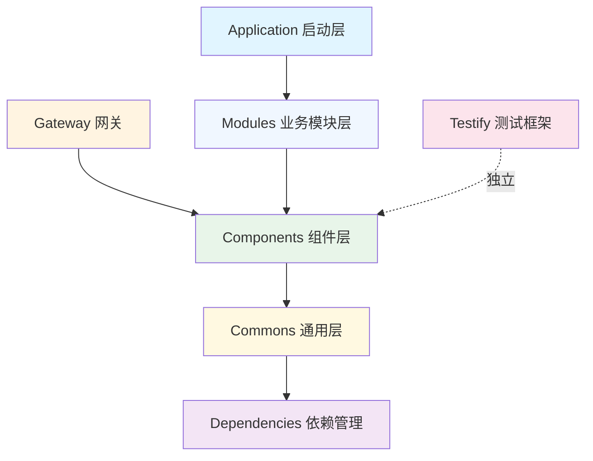

# LoadUp Framework

<div align="center">
  
  <p>
    <strong>现代化企业级微服务开发框架</strong>
  </p>
  <p>
    基于 Spring Boot 3.4.3 + JDK 21 构建的高性能、可扩展的单仓库架构框架
  </p>
</div>

---

## 🚀 项目简介

LoadUp Framework 是一个基于 Spring Boot 的企业级微服务开发框架，采用 **Monorepo（单仓库）多模块架构**设计，提供了一系列可复用的基础组件和最佳实践，帮助团队快速构建高质量、高性能的企业应用。

### 核心特性

- ✅ **模块化设计** - 清晰的模块边界，单一职责原则，严格的依赖管理
- ✅ **开箱即用** - 自动配置，最小化配置原则，快速启动
- ✅ **高性能** - 基于 JDK 21 虚拟线程，优化的数据库访问和缓存策略
- ✅ **可扩展** - 插件化架构，支持业务定制扩展
- ✅ **企业级** - 完善的安全机制、链路追踪、监控告警
- ✅ **测试友好** - 内置测试框架 Testify，支持单元测试和集成测试

---

## 📚 技术栈

| 技术领域 | 技术选型 | 版本 |
|---------|---------|------|
| 编程语言 | Java | 21 |
| 应用框架 | Spring Boot | 3.4.3 |
| 持久层框架 | MyBatis-Flex | 1.11.5 |
| 数据库 | MySQL | 8.0+ |
| 缓存 | Redis (Redisson) | 3.x |
| API 网关 | Custom Gateway | - |
| 认证授权 | JWT + RBAC | - |
| 链路追踪 | OpenTelemetry | 1.57.0 |
| 任务调度 | Quartz/XXL-Job | - |
| API 文档 | OpenAPI (Swagger) | v3 |
| 测试框架 | JUnit 5, Mockito, Testcontainers | - |
| 构建工具 | Maven | 3.6+ |

---

## 🏗️ 架构概览

LoadUp Framework 采用分层架构设计，各模块职责清晰，依赖关系单向：



### 核心模块说明

| 模块 | 说明 | 主要功能 |
|-----|------|---------|
| **loadup-dependencies** | 依赖管理 BOM | 统一管理所有依赖版本，避免版本冲突 |
| **loadup-commons** | 通用基础层 | 提供 API 定义、DTO、工具类等基础能力 |
| **loadup-components** | 技术组件层 | 封装缓存、数据库、调度、追踪等技术组件 |
| **loadup-modules** | 业务模块层 | 业务功能模块（如 UPMS 用户权限管理） |
| **loadup-gateway** | API 网关 | 统一路由、认证、鉴权、限流、监控 |
| **loadup-application** | 应用启动层 | Spring Boot 启动器，整合所有模块 |
| **loadup-testify** | 测试框架 | 提供完整的测试解决方案（独立模块） |

### 依赖关系规则

遵循**严格单向依赖**原则，避免循环依赖：

```
dependencies (基础)
    ↑
commons (通用层)
    ↑
components (组件层)
    ↑
modules (业务模块层)
    ↑
application (应用层)

gateway (独立) ← → commons, components
testify (独立测试框架)
```

详细架构设计请查看：📖 [架构设计文档](architecture.md)

---

## 🎯 快速开始

### 前置要求

- JDK 21+
- Maven 3.6+
- MySQL 8.0+
- Redis 5.0+

### 第一步：引入 BOM 依赖管理

在项目 `pom.xml` 中添加：

```xml
<dependencyManagement>
    <dependencies>
        <dependency>
            <groupId>io.github.loadup</groupId>
            <artifactId>loadup-dependencies</artifactId>
            <version>1.0.0-SNAPSHOT</version>
            <type>pom</type>
            <scope>import</scope>
        </dependency>
    </dependencies>
</dependencyManagement>
```

### 第二步：添加所需组件

```xml
<dependencies>
    <!-- 数据库组件 -->
    <dependency>
        <groupId>io.github.loadup</groupId>
        <artifactId>loadup-components-database</artifactId>
    </dependency>
    
    <!-- 缓存组件 -->
    <dependency>
        <groupId>io.github.loadup</groupId>
        <artifactId>loadup-components-cache</artifactId>
    </dependency>
    
    <!-- 更多组件... -->
</dependencies>
```

### 第三步：启动应用

```java
@SpringBootApplication
public class Application {
    public static void main(String[] args) {
        SpringApplication.run(Application.class, args);
    }
}
```

完整的快速开始指南：📖 [快速开始文档](quick-start.md)

---

## 📦 核心组件

### Commons 通用基础层

提供项目的基础能力和通用工具：

- **[loadup-commons-api](commons/commons-api.md)** - API 定义、异常体系、常量定义
- **[loadup-commons-dto](commons/commons-dto.md)** - 通用 DTO、分页对象、响应封装
- **[loadup-commons-util](commons/commons-util.md)** - 工具类库（日期、字符串、JSON 等）

### Components 技术组件层

可复用的技术组件，开箱即用：

| 组件 | 说明 | 文档 |
|-----|------|------|
| **Database** | 数据库访问（MyBatis-Flex + 审计） | [查看文档](components/database.md) |
| **Cache** | 缓存管理（Redis + Caffeine） | [查看文档](components/cache.md) |
| **Authorization** | 认证授权（JWT + RBAC） | [查看文档](components/authorization.md) |
| **Tracer** | 链路追踪（OpenTelemetry） | [查看文档](components/tracer.md) |
| **Scheduler** | 任务调度（Quartz/XXL-Job） | [查看文档](components/scheduler.md) |
| **Captcha** | 验证码生成 | [查看文档](components/captcha.md) |
| **DFS** | 分布式文件存储 | [查看文档](components/dfs.md) |
| **Liquibase** | 数据库版本管理 | [查看文档](components/liquibase.md) |
| **Extension** | 扩展点机制 | [查看文档](components/extension.md) |
| **Testcontainers** | 测试容器集成 | [查看文档](components/testcontainers.md) |

更多组件说明：📖 [Components 概览](components.md)

### Modules 业务模块层

封装业务功能的可复用模块：

- **[UPMS (User Permission Management System)](modules/upms.md)** - 用户权限管理系统
  - 用户管理
  - 角色管理
  - 权限管理
  - 组织架构管理

更多模块：📖 [Modules 概览](modules.md)

### Gateway 网关模块

统一的 API 网关，提供：

- ✅ 动态路由配置
- ✅ JWT 认证与鉴权
- ✅ 签名验签机制
- ✅ 限流与熔断
- ✅ 请求转发（HTTP/RPC/SpringBean）
- ✅ 监控与日志

详细文档：📖 [Gateway 网关文档](gateway.md)

### Testify 测试框架

独立的测试解决方案：

- 单元测试支持
- 集成测试支持
- Mock 数据生成
- 断言增强
- Testcontainers 集成

详细文档：📖 [Testify 测试框架](testify.md)

---

## 🛠️ 开发指南

### AI 辅助开发

我们提供了完善的 AI 编码指令，帮助你使用 GitHub Copilot 或 Cursor 快速生成符合项目规范的代码：

- 📖 [GitHub Copilot 指令](copilot-instructions.md)
- 📖 [AI 项目上下文](ai-project-context.md)

### 代码规范

- 遵循阿里巴巴 Java 开发手册
- 使用 Spotless 自动格式化代码
- 代码审查通过 CI/CD 自动检查

### 最佳实践

- **安全**：所有密码字段必须 `@JsonIgnore`，敏感信息脱敏
- **性能**：合理使用缓存，避免 N+1 查询问题
- **测试**：单元测试覆盖率 ≥ 70%
- **日志**：统一使用 `@Slf4j`，分级记录
- **异常**：统一异常处理，使用 `BusinessException`

---

## 🔧 故障排查

遇到问题？查看我们的故障排查指南：

- 🔍 [常见问题 FAQ](troubleshooting/)
- 🐛 [401 认证错误修复](troubleshooting/FIX_401_ERROR.md)
- 💡 [快速修复指南](troubleshooting/QUICK_START_401_FIX.md)

---

## 📖 完整文档导航

### 入门指南

- [项目概览](project-overview.md) - 深入了解项目背景和设计理念
- [架构设计](architecture.md) - 详细的架构设计和模块划分
- [快速开始](quick-start.md) - 从零开始构建第一个应用

### 核心模块文档

- [Dependencies 依赖管理](dependencies.md)
- [Commons 通用层](commons.md)
- [Components 组件层](components.md)
- [Modules 业务模块](modules.md)
- [Gateway 网关](gateway.md)
- [Application 应用层](application.md)
- [Testify 测试框架](testify.md)

### 开发者资源

- [AI 编码指南](ai-project-context.md)
- [GitHub Copilot 指令](copilot-instructions.md)
- [故障排查](troubleshooting/)

---

## 🤝 参与贡献

我们欢迎任何形式的贡献！

- 🐛 提交 Bug 报告
- 💡 提出新功能建议
- 📖 改进文档
- 🔧 提交代码 Pull Request

详细贡献指南请查看项目的 CONTRIBUTING.md 文件。

---

## 📄 许可证

LoadUp Framework 采用 [Apache License 2.0](LICENSE) 开源协议。

---

## 📞 联系我们

- **GitHub**: [https://github.com/loadup-cloud/loadup-framework](https://github.com/loadup-cloud/loadup-framework)
- **文档站**: [https://loadup-cloud.laysan.site](https://loadup-cloud.laysan.site)

---

<div align="center">
  <p>
    由 <a href="https://github.com/loadup-cloud">LoadUp Team</a> 用 ❤️ 构建
  </p>
</div>
