# LoadUp UPMS - User Permission Management System

[](LICENSE)
[](https://spring.io/projects/spring-boot)
[](https://www.oracle.com/java/)
[](https://mybatis-flex.com/)

基于 **COLA 4.0** 架构的企业级用户权限管理系统，实现 **RBAC3** (角色继承与约束) 权限模型，采用 **MyBatis-Flex** 提供类型安全的数据访问。

## 🎯 核心特性

### 1. RBAC3 权限模型
- ✅ **角色继承**: 支持多级角色继承，子角色自动继承父角色权限
- ✅ **静态职责分离 (SSD)**: 互斥角色约束
- ✅ **动态职责分离 (DSD)**: 会话级别的角色激活约束
- ✅ **数据权限**: 5种数据范围控制（全部/自定义/本部门/本部门及子部门/仅本人）

### 2. 组织架构管理
- 📁 **无限层级部门树**: 支持任意深度的组织结构
- 👥 **部门维度授权**: 支持按部门分配角色和权限
- 🔄 **部门迁移**: 用户和子部门的批量转移

### 3. 用户中心
- 🔐 **多种登录方式**: 用户名/邮箱/手机号登录
- 📱 **第三方登录**: 支持微信、QQ、GitHub、Google等社交账号（详见下文"第三方登录"章节）
- 🖼️ **头像管理**: 集成DFS组件，支持头像上传
- 🔒 **安全策略**:
    - 登录失败自动锁定
    - 密码强度校验
    - JWT令牌管理
    - 双Token机制（access + refresh）

### 4. 系统监控
- 📊 **操作日志**: AOP异步记录用户行为
- 🔍 **多维度查询**: 按用户/时间/操作类型/IP等条件检索
- 📈 **登录审计**: 完整的登录/登出日志记录
- ⚡ **性能监控**: 接口执行时间统计

## 🏗️ 架构设计

采用 **COLA 4.0** 分层架构，严格遵循领域驱动设计（DDD）原则：

```
loadup-modules-upms/
├── loadup-modules-upms-adapter/      # 适配层：REST API、DTO
├── loadup-modules-upms-app/          # 应用层：业务编排、Command/Query
├── loadup-modules-upms-domain/       # 领域层：实体、值对象、Repository接口
├── loadup-modules-upms-infrastructure/ # 基础设施层：Repository实现、Security配置
└── loadup-modules-upms-starter/      # Starter：自动配置
```

### 架构优势

| 层次 | 职责 | 依赖方向 |
|------|------|----------|
| **Adapter** | 接收外部请求，数据转换 | → App |
| **App** | 业务流程编排，事务管理 | → Domain |
| **Domain** | 核心业务逻辑，领域规则 | 无依赖 |
| **Infrastructure** | 技术实现，外部集成 | → Domain |

## 📊 数据库设计

### 核心表结构

#### 1. 用户表 (`upms_user`)
存储用户基本信息和安全策略配置。

| 字段 | 类型 | 说明 |
|------|------|------|
| id | BIGINT | 主键 |
| username | VARCHAR(50) | 用户名（唯一） |
| password | VARCHAR(200) | BCrypt加密密码 |
| dept_id | BIGINT | 所属部门 |
| status | SMALLINT | 状态：1-正常 0-停用 2-锁定 |
| login_fail_count | INT | 登录失败次数 |
| locked_time | TIMESTAMP | 锁定时间 |

#### 2. 角色表 (`upms_role`)
支持角色继承的角色定义。

| 字段 | 类型 | 说明 |
|------|------|------|
| id | BIGINT | 主键 |
| role_code | VARCHAR(50) | 角色编码（唯一） |
| parent_role_id | BIGINT | 父角色ID（用于继承） |
| data_scope | SMALLINT | 数据权限范围 |

#### 3. 权限表 (`upms_permission`)
树状结构的权限资源定义。

| 字段 | 类型 | 说明 |
|------|------|------|
| id | BIGINT | 主键 |
| permission_code | VARCHAR(100) | 权限编码（唯一） |
| permission_type | SMALLINT | 类型：1-菜单 2-按钮 3-接口 |
| resource_path | VARCHAR(200) | 资源路径/URL |

#### 4. 部门表 (`upms_department`)
支持无限层级的组织架构树。

| 字段 | 类型 | 说明 |
|------|------|------|
| id | BIGINT | 主键 |
| parent_id | BIGINT | 父部门ID |
| dept_level | INT | 部门层级 |

#### 5. OAuth 配置表 (`oauth_provider_config`)
存储第三方登录平台的配置信息。

| 字段 | 类型 | 说明 |
|------|------|------|
| id | BIGINT | 主键 |
| provider | VARCHAR(50) | 渠道编码（WECHAT_OPEN、GITHUB等） |
| app_id | VARCHAR(200) | 应用ID/Client ID |
| app_secret | VARCHAR(500) | 应用密钥（加密存储） |
| enabled | BOOLEAN | 是否启用 |

#### 6. 用户OAuth绑定表 (`user_oauth_binding`)
记录用户与第三方账号的绑定关系。

| 字段 | 类型 | 说明 |
|------|------|------|
| id | BIGINT | 主键 |
| user_id | BIGINT | 系统用户ID |
| provider | VARCHAR(50) | 渠道编码 |
| open_id | VARCHAR(200) | 第三方平台用户ID |
| union_id | VARCHAR(200) | 联合ID（可选） |
| bind_time | TIMESTAMP | 绑定时间 |

### ER图概览

```
┌─────────────┐       ┌─────────────┐       ┌─────────────┐
│   upms_user │───┬───│ upms_user_  │───┬───│   upms_role │
│             │   │   │    role     │   │   │             │
└─────────────┘   │   └─────────────┘   │   └─────────────┘
                  │                     │            │
                  │                     │            │ parent_role_id
                  │                     │            ▼
                  │                     │   ┌─────────────┐
                  │                     │   │  upms_role  │
                  │                     │   │  (inherit)  │
                  │                     │   └─────────────┘
                  │                     │            │
                  │   ┌─────────────┐   │            │
                  └───│   upms_     │◄──┘            │
                      │ department  │                │
                      └─────────────┘                │
                                                     │
                      ┌─────────────┐                │
                      │  upms_role_ │◄───────────────┘
                      │ permission  │
                      └─────────────┘
                              │
                              ▼
                      ┌─────────────┐
                      │   upms_     │
                      │ permission  │
                      └─────────────┘
```

完整的数据库Schema请参考：[schema.sql](./schema.sql)

## 🚀 快速开始

### 1. 依赖引入

在你的Spring Boot项目中添加依赖：

```xml
<dependency>
    <groupId>io.github.loadup-cloud</groupId>
    <artifactId>loadup-modules-upms-starter</artifactId>
    <version>1.0.0-SNAPSHOT</version>
</dependency>
```

### 2. 数据库初始化

执行数据库脚本创建表结构：

```bash
mysql -u root -p loadup_upms < schema.sql
```

默认创建管理员账号：
- 用户名：`admin`
- 密码：`admin123`

### 3. 配置文件

复制 `application.yml.example` 并根据实际环境修改：

```yaml
spring:
  datasource:
    url: jdbc:mysql://localhost:3306/loadup_upms?useSSL=false&serverTimezone=UTC&allowPublicKeyRetrieval=true
    username: your_username
    password: your_password

upms:
  security:
    jwt:
      secret: your-secret-key-at-least-32-characters-long
    login:
      max-fail-attempts: 5
      lock-duration: 30
    captcha:
      enabled: true
```

### 4. 启动应用

```bash
mvn spring-boot:run
```

访问 Swagger 文档：`http://localhost:8080/swagger-ui.html`

## 📖 MyBatis-Flex 使用指南

本模块使用 **MyBatis-Flex** 提供类型安全的数据库访问。

### 快速开始

#### 1. 导入 Tables 定义

```java

```

#### 2. 基础查询

```java
// 单条件查询
QueryWrapper query = QueryWrapper.create()
                .where(USER.USERNAME.eq("admin"));

// 多条件查询  
QueryWrapper query = QueryWrapper.create()
        .where(USER.STATUS.eq((short) 1))
        .and(USER.DEPT_ID.in(deptIds))
        .orderBy(USER.CREATE_TIME.desc());
```

#### 3. 分页查询

```java
Page<UserDO> page = userMapper.paginate(
        Page.of(pageNum, pageSize),
        query
);
```

### 常用查询模式

| 方法                | SQL                 | 示例                                     |
|-------------------|---------------------|----------------------------------------|
| `eq(value)`       | `= value`           | `USER.STATUS.eq(1)`                    |
| `like(value)`     | `LIKE '%value%'`    | `USER.USERNAME.like("admin")`          |
| `in(values)`      | `IN (...)`          | `USER.DEPT_ID.in(1, 2, 3)`             |
| `between(v1, v2)` | `BETWEEN v1 AND v2` | `USER.CREATE_TIME.between(start, end)` |
| `isNull()`        | `IS NULL`           | `USER.DELETED.isNull()`                |

### 优势

- ✅ **类型安全**：编译时检查字段名，避免运行时错误
- ✅ **自动完成**：IDE 提供字段自动补全
- ✅ **重构友好**：字段重命名时自动更新
- ✅ **性能优化**：自动分页，无需手动编写 SQL

更多用法请参考 [ARCHITECTURE.md](./ARCHITECTURE.md) 中的 MyBatis-Flex 章节。

## 📡 API 文档

### 统一响应格式

所有API统一使用POST方法，响应格式统一为：

```json
{
  "result": {
    "success": true,
    "errCode": null,
    "errMessage": null
  },
  "data": {
    ...
  }
}
```

### 认证接口

#### 登录
```http
POST /api/v1/auth/login
Content-Type: application/json

{
  "username": "admin",
  "password": "admin123",
  "captchaKey": "optional-key",
  "captchaCode": "optional-code"
}
```

**响应示例：**
```json
{
  "result": {
    "success": true,
    "errCode": null,
    "errMessage": null
  },
  "data": {
    "accessToken": "eyJhbGciOiJIUzI1NiIsInR5cCI6IkpXVCJ9...",
    "refreshToken": "eyJhbGciOiJIUzI1NiIsInR5cCI6IkpXVCJ9...",
    "tokenType": "Bearer",
    "expiresIn": 86400000,
    "userInfo": {
      "id": 1,
      "username": "admin",
      "nickname": "超级管理员",
      "roles": [
        "ROLE_SUPER_ADMIN"
      ],
      "permissions": [
        "system:user:query",
        "system:user:create",
        ...
      ]
    }
  }
}
```

#### 注册
```http
POST /api/v1/auth/register
Content-Type: application/json

{
  "username": "testuser",
  "password": "Password123",
  "nickname": "测试用户",
  "email": "test@example.com",
  "phone": "13800138000"
}
```

#### 刷新令牌
```http
POST /api/v1/auth/refresh-token
Content-Type: application/json

{
  "refreshToken": "your-refresh-token"
}
```

### 第三方登录接口

UPMS 支持多种第三方登录方式，采用统一的接口设计，方便扩展新的登录渠道。

#### 支持的登录渠道

| 渠道 | 渠道编码 | 说明 |
|------|---------|------|
| 微信开放平台 | `WECHAT_OPEN` | 网页微信登录 |
| 微信公众号 | `WECHAT_MP` | 公众号内授权登录 |
| QQ | `QQ` | QQ互联登录 |
| 微博 | `WEIBO` | 微博登录 |
| GitHub | `GITHUB` | GitHub OAuth登录 |
| Google | `GOOGLE` | Google OAuth登录 |
| 支付宝 | `ALIPAY` | 支付宝授权登录 |
| 钉钉 | `DINGTALK` | 钉钉扫码登录 |
| 企业微信 | `WECHAT_WORK` | 企业微信登录 |

#### 1. 获取授权URL

客户端首先调用此接口获取第三方平台的授权URL，然后跳转到该URL让用户授权。

```http
POST /api/v1/auth/oauth/authorization-url
Content-Type: application/json

{
  "provider": "WECHAT_OPEN",
  "redirectUri": "https://yourapp.com/oauth/callback",
  "state": "random-state-string"
}
```

**响应示例：**
```json
{
  "result": {
    "success": true
  },
  "data": {
    "authorizationUrl": "https://open.weixin.qq.com/connect/qrconnect?appid=xxx&redirect_uri=xxx&response_type=code&scope=snsapi_login&state=xxx",
    "provider": "WECHAT_OPEN",
    "state": "random-state-string"
  }
}
```

#### 2. 授权回调处理

用户在第三方平台完成授权后，第三方平台会回调到 `redirectUri`，携带 `code` 和 `state` 参数。客户端需要将这些参数发送到后端进行处理。

```http
POST /api/v1/auth/oauth/callback
Content-Type: application/json

{
  "provider": "WECHAT_OPEN",
  "code": "authorization-code-from-provider",
  "state": "random-state-string"
}
```

**响应示例（已绑定账号）：**
```json
{
  "result": {
    "success": true
  },
  "data": {
    "bound": true,
    "accessToken": "eyJhbGciOiJIUzI1NiIsInR5cCI6IkpXVCJ9...",
    "refreshToken": "eyJhbGciOiJIUzI1NiIsInR5cCI6IkpXVCJ9...",
    "tokenType": "Bearer",
    "expiresIn": 86400000,
    "userInfo": {
      "id": 1,
      "username": "wechat_user",
      "nickname": "微信用户",
      "avatar": "https://wx.qlogo.cn/..."
    }
  }
}
```

**响应示例（未绑定账号）：**
```json
{
  "result": {
    "success": true
  },
  "data": {
    "bound": false,
    "bindToken": "temp-bind-token-for-account-binding",
    "expiresIn": 300000,
    "oauthUserInfo": {
      "provider": "WECHAT_OPEN",
      "openId": "oauth-provider-user-id",
      "nickname": "微信昵称",
      "avatar": "https://wx.qlogo.cn/...",
      "gender": 1,
      "unionId": "wechat-union-id"
    }
  }
}
```

#### 3. 绑定已有账号

当用户首次使用第三方登录且该第三方账号未绑定系统账号时，需要调用此接口进行绑定。

```http
POST /api/v1/auth/oauth/bind-existing
Content-Type: application/json

{
  "bindToken": "temp-bind-token-from-callback",
  "username": "existing_user",
  "password": "user_password"
}
```

**响应示例：**
```json
{
  "result": {
    "success": true
  },
  "data": {
    "accessToken": "eyJhbGciOiJIUzI1NiIsInR5cCI6IkpXVCJ9...",
    "refreshToken": "eyJhbGciOiJIUzI1NiIsInR5cCI6IkpXVCJ9...",
    "tokenType": "Bearer",
    "expiresIn": 86400000,
    "userInfo": {
      "id": 1,
      "username": "existing_user",
      "nickname": "用户昵称"
    }
  }
}
```

#### 4. 创建新账号并绑定

用户也可以选择创建一个新账号并绑定第三方登录。

```http
POST /api/v1/auth/oauth/bind-new
Content-Type: application/json

{
  "bindToken": "temp-bind-token-from-callback",
  "username": "new_username",
  "password": "Password123",
  "nickname": "昵称",
  "email": "email@example.com",
  "phone": "13800138000"
}
```

**响应格式同上。**

#### 5. 解绑第三方账号

用户可以解绑已绑定的第三方账号。

```http
POST /api/v1/auth/oauth/unbind
Content-Type: application/json
Authorization: Bearer {accessToken}

{
  "provider": "WECHAT_OPEN"
}
```

#### 6. 查询已绑定的第三方账号

```http
POST /api/v1/auth/oauth/bindings
Content-Type: application/json
Authorization: Bearer {accessToken}

{}
```

**响应示例：**
```json
{
  "result": {
    "success": true
  },
  "data": [
    {
      "provider": "WECHAT_OPEN",
      "openId": "masked-open-id",
      "nickname": "微信昵称",
      "avatar": "https://wx.qlogo.cn/...",
      "bindTime": "2026-01-15T10:30:00"
    },
    {
      "provider": "GITHUB",
      "openId": "masked-github-id",
      "nickname": "GitHub User",
      "avatar": "https://avatars.githubusercontent.com/...",
      "bindTime": "2026-02-20T15:45:00"
    }
  ]
}
```

### 第三方登录架构设计

#### 数据库设计

**oauth_provider_config 表**（第三方平台配置）

| 字段 | 类型 | 说明 |
|------|------|------|
| id | BIGINT | 主键 |
| provider | VARCHAR(50) | 渠道编码（唯一） |
| app_id | VARCHAR(200) | 应用ID/Client ID |
| app_secret | VARCHAR(500) | 应用密钥（加密存储） |
| authorization_url | VARCHAR(500) | 授权URL模板 |
| token_url | VARCHAR(500) | 获取Token的URL |
| user_info_url | VARCHAR(500) | 获取用户信息的URL |
| enabled | BOOLEAN | 是否启用 |
| properties | JSON | 扩展配置 |

**user_oauth_binding 表**（用户绑定关系）

| 字段 | 类型 | 说明 |
|------|------|------|
| id | BIGINT | 主键 |
| user_id | BIGINT | 系统用户ID |
| provider | VARCHAR(50) | 渠道编码 |
| open_id | VARCHAR(200) | 第三方平台用户ID |
| union_id | VARCHAR(200) | 联合ID（如微信UnionID） |
| access_token | VARCHAR(500) | 第三方访问令牌 |
| refresh_token | VARCHAR(500) | 第三方刷新令牌 |
| expires_at | TIMESTAMP | 令牌过期时间 |
| user_info | JSON | 第三方用户信息快照 |
| bind_time | TIMESTAMP | 绑定时间 |
| last_login_time | TIMESTAMP | 最后登录时间 |

**约束**：
- 唯一索引：`uk_provider_open_id` (provider + open_id)
- 索引：`idx_user_id` (user_id)

#### 核心流程

```mermaid
sequenceDiagram
    participant C as 客户端
    participant G as Gateway
    participant U as UPMS
    participant O as OAuth Provider

    Note over C,O: 1. 获取授权URL
    C->>G: POST /oauth/authorization-url
    G->>U: 转发请求
    U->>U: 从配置表获取provider配置
    U->>U: 生成state并缓存
    U->>C: 返回授权URL
    
    Note over C,O: 2. 用户授权
    C->>O: 重定向到授权页面
    O->>O: 用户同意授权
    O->>C: 重定向回调URL (带code和state)
    
    Note over C,O: 3. 处理回调
    C->>G: POST /oauth/callback {code, state}
    G->>U: 转发请求
    U->>U: 验证state
    U->>O: 用code换取access_token
    O->>U: 返回access_token
    U->>O: 用access_token获取用户信息
    O->>U: 返回用户信息
    U->>U: 根据openId查询绑定关系
    
    alt 已绑定
        U->>U: 生成JWT token
        U->>C: 返回accessToken和用户信息
    else 未绑定
        U->>U: 生成临时bindToken
        U->>C: 返回bindToken和第三方用户信息
    end
    
    Note over C,O: 4. 绑定账号（如需要）
    C->>G: POST /oauth/bind-existing
    G->>U: 转发请求
    U->>U: 验证bindToken
    U->>U: 验证用户名密码
    U->>U: 创建绑定关系
    U->>U: 生成JWT token
    U->>C: 返回accessToken和用户信息
```



#### 配置示例

```yaml
upms:
  oauth:
    providers:
      wechat-open:
        app-id: wx1234567890abcdef
        app-secret: your-wechat-app-secret
        authorization-url: https://open.weixin.qq.com/connect/qrconnect
        token-url: https://api.weixin.qq.com/sns/oauth2/access_token
        user-info-url: https://api.weixin.qq.com/sns/userinfo
        enabled: true
        
      github:
        app-id: your-github-client-id
        app-secret: your-github-client-secret
        authorization-url: https://github.com/login/oauth/authorize
        token-url: https://github.com/login/oauth/access_token
        user-info-url: https://api.github.com/user
        enabled: true
        
      google:
        app-id: your-google-client-id
        app-secret: your-google-client-secret
        authorization-url: https://accounts.google.com/o/oauth2/v2/auth
        token-url: https://oauth2.googleapis.com/token
        user-info-url: https://www.googleapis.com/oauth2/v2/userinfo
        enabled: true
    
    # 临时bindToken有效期（秒）
    bind-token-expiration: 300
    
    # 是否允许自动创建账号（未绑定时）
    auto-create-account: false
```

#### 扩展新的登录渠道

要添加新的第三方登录渠道，只需实现 `OAuthProvider` 接口：

```java
@Component
public class CustomOAuthProvider implements OAuthProvider {
    
    @Override
    public String getProviderCode() {
        return "CUSTOM";
    }
    
    @Override
    public String buildAuthorizationUrl(OAuthConfig config, String redirectUri, String state) {
        // 构建授权URL
        return String.format("%s?client_id=%s&redirect_uri=%s&state=%s",
            config.getAuthorizationUrl(),
            config.getAppId(),
            URLEncoder.encode(redirectUri, StandardCharsets.UTF_8),
            state);
    }
    
    @Override
    public OAuthToken getAccessToken(OAuthConfig config, String code) {
        // 用授权码换取access_token
        // HTTP调用第三方平台的token接口
        return oauthToken;
    }
    
    @Override
    public OAuthUserInfo getUserInfo(OAuthConfig config, String accessToken) {
        // 获取第三方用户信息
        // HTTP调用第三方平台的用户信息接口
        return userInfo;
    }
}
```

注册后，系统会自动发现并支持该渠道。

### 用户管理接口

#### 创建用户

```http
POST /api/v1/users/create
Content-Type: application/json

{
  "username": "newuser",
  "password": "Password123",
  "nickname": "新用户",
  "deptId": 1,
  "roleIds": [2, 3]
}
```

#### 查询用户列表

```http
POST /api/v1/users/query
Content-Type: application/json

{
  "page": 1,
  "size": 10,
  "username": "admin"
}
```

**响应示例（分页）：**

```json
{
  "result": {
    "success": true
  },
  "data": [
    ...
  ],
  "totalCount": 100,
  "pageSize": 10,
  "pageIndex": 1
}
```

#### 获取用户详情

```http
POST /api/v1/users/get
Content-Type: application/json

{
  "id": 1
}
```

#### 更新用户

```http
POST /api/v1/users/update
Content-Type: application/json

{
  "id": 1,
  "nickname": "新昵称",
  "email": "newemail@example.com"
}
```

#### 删除用户

```http
POST /api/v1/users/delete
Content-Type: application/json

{
  "id": 1
}
```

#### 锁定/解锁用户

```http
POST /api/v1/users/lock
Content-Type: application/json

{
  "id": 1
}
```

### 角色管理接口

#### 获取角色树

```http
POST /api/v1/roles/tree
Content-Type: application/json

{}
```

#### 分配权限给角色

```http
POST /api/v1/roles/assign-permissions
Content-Type: application/json

{
  "roleId": 2,
  "permissionIds": [1, 2, 3, 4]
}
```

### 权限管理接口

#### 获取用户菜单树

```http
POST /api/v1/permissions/user-menu-tree
Content-Type: application/json

{
  "id": 1
}
```

#### 按类型获取权限

```http
POST /api/v1/permissions/by-type
Content-Type: application/json

{
  "permissionType": 1
}
```

权限类型：

- `1` - 菜单权限
- `2` - 按钮权限
- `3` - API权限

完整API文档请访问 Swagger UI：`http://localhost:8080/swagger-ui.html`

## 🔧 高级配置

### 配置检查清单

部署前请确保：

#### 基础环境

- ✅ JDK 17+ 已安装
- ✅ Maven 3.8+ 已安装
- ✅ MySQL 8.0+ 已安装并运行
- ✅ Redis 6.0+ 已安装并运行（可选）

#### 数据库初始化

1. 创建数据库：`CREATE DATABASE loadup_upms;`
2. 执行脚本：`mysql -u root -p loadup_upms < schema.sql`
3. 验证表创建成功（应有12张表）
4. 验证初始数据：默认管理员 `admin/admin123`

### JWT密钥配置 ⚠️ 重要

```yaml
upms:
  security:
    jwt:
      # 生产环境必须修改！至少32个字符
      secret: your-secret-key-at-least-32-characters-long-change-in-production
      expiration: 86400000  # 24小时
```

**生成安全密钥**：

```bash
openssl rand -base64 32
```

### 自定义白名单

在 `application.yml` 中配置不需要认证的路径：

```yaml
upms:
  security:
    whitelist:
      - /public/**
      - /api/v1/public/**
      - /health
```

### 验证码开关

动态控制验证码验证：

```yaml
upms:
  security:
    captcha:
      enabled: true    # 设置为false可关闭验证码
      type: image      # image: 图形验证码, sms: 短信验证码
      expiration: 300  # 有效期（秒）
```

### 登录锁定策略

```yaml
upms:
  security:
    login:
      max-fail-attempts: 5      # 最大失败次数
      lock-duration: 30         # 锁定时长（分钟）
      enable-failure-tracking: true
```

### 数据权限使用

在Service方法上使用 `@DataScope` 注解：

```java
@DataScope(deptAlias = "d")
public List<User> findUsers() {
    // 自动根据用户角色的data_scope字段过滤数据
}
```

### 操作日志记录

在需要记录的方法上添加注解：

```java
@OperationLog(
    type = "CREATE",
    module = "用户管理",
    description = "创建新用户",
    recordResponse = true
)
public User createUser(UserCreateCommand command) {
    // ...
}
```

## 🧪 测试

### 单元测试

```bash
mvn test
```

### 集成测试（使用 Testcontainers）

```bash
mvn verify -P integration-test
```

集成测试会自动启动MySQL和Redis容器。

## 📦 组件依赖

本模块依赖以下 LoadUp 组件：

| 组件 | 用途 |
|------|------|
| `loadup-components-authorization` | 方法级权限控制 |
| `loadup-components-database` | 数据库连接池和事务管理 |
| `loadup-components-cache` | Redis缓存支持 |
| `loadup-components-captcha` | 验证码生成和验证 |
| `loadup-components-dfs` | 分布式文件存储（头像） |
| `loadup-components-gotone` | 短信/邮件通知 |
| `loadup-components-scheduler` | 定时任务（日志清理） |
| `loadup-components-signature` | OAuth签名验证 |
| `loadup-components-globalunique` | 第三方登录幂等性控制 |

## 🔐 安全最佳实践

1. **密码策略**
    - 使用BCrypt加密，不可逆
    - 强制密码复杂度要求
    - 定期更新密码提醒

2. **令牌管理**
    - 双Token机制（access + refresh）
    - access token短期有效（24小时）
    - refresh token长期有效（7天）
    - 支持令牌撤销（黑名单机制）

3. **防暴力破解**
    - 登录失败计数
    - 自动账号锁定
    - 验证码验证

4. **审计日志**
    - 完整的操作记录
    - 敏感操作二次验证
    - 日志防篡改

5. **第三方登录安全**
    - **State参数验证**：防止CSRF攻击，每次授权使用唯一的state值
    - **AppSecret加密存储**：数据库中的app_secret必须加密存储
    - **令牌有效期管理**：定期刷新第三方平台的access_token
    - **绑定关系验证**：绑定前验证用户身份（密码或验证码）
    - **敏感信息脱敏**：第三方用户信息中的openId等脱敏展示
    - **HTTPS强制**：所有OAuth回调URL必须使用HTTPS
    - **限流控制**：对授权URL生成和回调处理接口进行限流
    - **bindToken时效**：临时绑定令牌设置短时效（默认5分钟）

## 📝 TODO

- [ ] 添加多因素认证（MFA）
- [ ] 支持LDAP/AD集成
- [x] OAuth 2.0 第三方登录（已支持微信、QQ、GitHub、Google等）
- [ ] 细粒度字段级权限控制
- [ ] 在线用户管理和强制下线
- [ ] 权限缓存预热和刷新机制
- [ ] GraphQL API支持


---

**Built with ❤️ by LoadUp Framework Team**
