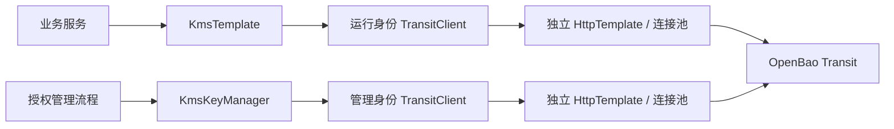

# Kms 架构

## 目标与边界

为 LoadUp 消费工程提供 OpenBao Transit 的小型 Java 门面。复用现有 HTTP 技术栈，不建设独立密钥平台，不存储私钥、不依赖业务数据库、不接管认证登录与续租。首版仅针对一个已确认后端，采用单一 jar；未来确有第二后端再评估 SPI/binder，当前不提前增加层次。

## 结构与职责

| 类型 | 职责 |
|------|------|
| `KmsTemplate` | 引用密钥执行密码操作，读取元数据和版本公钥 |
| `KmsKeyManager` | 可选的生成、轮换、最低版本和受控导入 |
| `KmsKeyRef` | 名称与调用方选择版本；0 表示操作时最新 |
| `KmsSignature` | 原始字节、算法与版本；防御性复制，安全 `toString` |
| `KmsCiphertext` | 密钥身份及不透明 Transit 包装串，安全 `toString` |
| `KmsTokenProvider` / `KmsManagementTokenProvider` | 各自身份的动态令牌来源 |
| `OpenBaoTransitClient` | API 路径、Base64 JSON 协议、HTTP 状态映射与响应校验 |
| `KmsAutoConfiguration` | 显式启用、可替换 Bean、两套独立资源生命周期 |

底层依赖为 KMS → HTTP → RestClient / Apache HttpClient 5；使用 Boot 提供的 Jackson 3 ObjectMapper、RestClient.Builder、可选 SSL Bundle 和 MeterRegistry。无需 Spring Vault，避免额外引入一套客户端、连接池和 Jackson 依赖。

## 密钥所有权与版本

密钥材料由 OpenBao 保管。应用只持有名称、版本、公钥、签名或密文。OpenBao 是版本和状态的唯一权威，组件不缓存最新版本；新签名和加密先读取元数据并将具体版本写入请求，即使并发轮换也不会混淆结果所属版本。代价是每次新操作多一次元数据请求，运行身份必须有该密钥的读取权限。

验签和解密根据保存的版本执行，先验证调用方预期密钥与输入记录一致；最低版本、能力及访问权限由服务器最终约束。组件无删除/导出/备份端点，但已有密钥是否可导出、其他身份是否能修改策略，由服务器治理决定。创建接口对已存在名称的行为不能用来证明既有密钥安全属性。

服务端全局关闭 upsert，运行令牌没有加密路径的 create 能力；仅在客户端先读取元数据并不足以抵御并发删除造成的自动新建问题。默认不自动轮换，支付渠道需将公钥登记与版本切换作为受控业务流程。

## 协议与算法

原始输入使用标准 Base64 传输。密码操作保持 Transit 的 `vault:vN:` 包装语义，签名门面将其转为原始签名字节，验签再重建包装。Base64 编码不是加密，不能将请求体输出到日志。

RSA 签名固定 SHA-256、`prehashed=false`，显式区分 PKCS#1 v1.5 与 PSS（hash 长度 salt）。调用方提交已经规范化的原始字节，避免混入渠道字段排序、业务 JSON 再序列化或双重摘要。AES-GCM 密文由 OpenBao 管理 nonce；首版不暴露手动 nonce、AAD 或派生上下文。

RSA 加密采用服务端 Transit 算法，不提供跨渠道报文兼容保证，也不做大文件分块；大数据使用 AES 或上层信封加密方案。SM2/SM4 不在当前后端能力范围内。

导入仅转发受控工具生成的 BYOK 包装串（SHA256），或公开 RSA PEM；不在应用内引入私钥解析与包装工具。导入请求关闭内部轮换；`import_version`、证书登记与轮换协调留待业务需要。

## 认证与隔离

两个接口有独立 Provider 类型、令牌环境变量和专用 HTTP 池，管理开关默认关闭。每次调用获取当前令牌，支持集成方替换动态登录/续租实现；不定时缓存静态配置中的令牌。身份策略按实际密钥和操作授权，管理接口不能直接映射成开放 Controller。

配置限制服务原点、挂载路径和密钥名称，避免动态输入控制远端地址。HTTPS 默认必需，本地 HTTP 明确启用；允许内部网络地址是因为 KMS 是可信配置中的内部服务。SSL Bundle 提供受信 CA/mTLS。HTTP 默认无重试和重定向，禁用失败后的本地密钥降级。

## 失败、资源与观测

验签返回 `false` 仅代表正常响应中的不匹配；鉴权失败、服务异常、无效响应独立抛 `KmsException`。无远端正文、令牌或底层 cause。输入在网络前限制大小，响应有有限长度，数字版本与布尔结果检查类型。创建/轮换超时属于结果未知，调用方先查状态再作决策。

Spring 关闭上下文时释放两套池。通过 HTTP 固定标签 `client=kms|kms-admin`、`operation=metadata|sign|...` 记录计时；不将密钥名、商户号、输入或签名作为指标标签。复用 Boot RestClient 观测机制；真实 Trace 传播及日志采集需消费工程验证，不假定外部全局拦截器一定脱敏。

## 验证与扩展

协议夹具用于检查路径、参数、身份、状态映射和签名与 JCA 的互操作；不是 OpenBao 的仿真实现，也不能证明服务端 ACL、TLS、持久化或解封流程。真实服务的轮换、历史数据、BYOK、公钥导入、封印/重启、ACL、续租和故障恢复是生产验收项。

后续仅按需求增加已验证的 OpenBao 能力，复用现有认证与运维设施。Signature 请求协议通过 `KmsTemplate` 使用远程密码操作，负责报文规范化、时间窗口和防重放；其原有本地签名接口不自动改成远程调用。消费者明确选择密钥所有权与调用方式，KMS 本身不依赖 Signature。

协议参考：[OpenBao Transit API](https://openbao.org/docs/api/secret/transit/)；待完成验收见 [ROADMAP](../../ROADMAP.md)。
