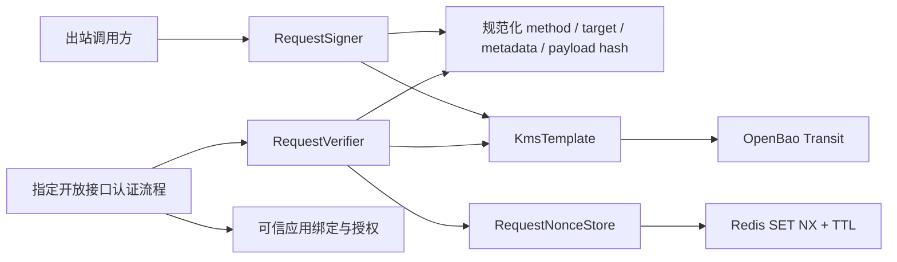

# Signature 架构

## 职责与依赖

Signature 负责请求签名协议；KMS 负责密码操作和密钥版本；OpenBao 保管私钥。原有本地 JCA 工具仍是独立密码原语，不能替代请求协议的覆盖范围和防重放校验。

组件仍为单一 jar。请求协议硬依赖 KMS，与其共享 HTTP/Boot 技术栈；Redis Starter 是可选依赖，只在消费工程有 `StringRedisTemplate` 时装配存储适配器。没有新增数据库表或另一套密钥/商户管理平台。

## 小型调用接口

- `RequestSigner.sign(identity, content)` 自动生成时间与随机 nonce，返回可发送的签名头。
- `RequestVerifier.verify(trustedIdentity, content, signature)` 完成校验和 nonce 消费；只有正常返回才允许进入业务。
- `RequestSigningIdentity` 由业务绑定提供名称、明确版本、允许算法和接收方；客户端元数据不是受信身份。
- `RequestContent` 保存实际原始请求目标与字节，防御性复制，不依赖 Servlet。
- `RequestSignatureParameters` 及 `RequestSignature` 表达版本化协议，不在通用业务 DTO 中塞入签名字段。
- `RequestNonceStore` 是唯一存储 seam，其契约要求跨实例原子占位和 TTL；Redis 是现有 Spring Data Redis 的小型 Adapter。

签名和验签分别装配：出站签名无需 nonce 后端；接收验签缺少后端时启动失败。自定义 Store 覆盖默认 Redis 实现，业务不可提供“总是成功”的占位实现用于生产。

## 协议决策

首版明确为 LoadUp request v1 固定协议，不声称实现完整 [RFC 9421](https://www.rfc-editor.org/rfc/rfc9421.html)。参考 HTTP 消息签名关于覆盖内容、时间和上下文的安全要求；组件的字段、头名称和编码以 README 的固定向量为准。

不对 query Map 排序，因为解码、重复参数、`+`/`%20` 和编码差异可能引起解释不一致；签实际发送的 raw target。不解析 JSON，因为解析后重新序列化会失去原始内容。body 先 SHA-256，整个规范原文再交给 KMS 执行 RSA SHA-256，不将 body 摘要误作为完整签名原文。

固定顺序、标签与 LF（包括尾部 LF）避免串联歧义，所有行字段禁止原始换行。协议、appId、audience、版本、算法也进入签名，防止修改路由上下文或算法选择。唯一 audience 约束接收服务，减少相同密钥跨服务部署的误用；它不代替 TLS 或业务授权。

Content-Type 纳入签名，body 处理方式不能被任意改变。未覆盖的 HTTP 头不能用于决定业务权限、租户或改变报文含义；影响业务的参数放入签名 body/target 或通过认证身份确定。内容编码/代理重写须在消费工程规定并测试，首版按最终交给业务处理的相同原始内容验签。

明确版本是前置条件：签名前必须知道版本以将其纳入原文。KMS 不缓存最新版本，本协议不擅自轮换/选择 latest；应用需协调接收方公钥登记和允许版本列表。

## 安全执行顺序

1. 验证头结构、大小、唯一性、原始内容和受信绑定。
2. 先拒绝过期/过远未来请求，减少无效 KMS 调用。
3. 通过可信密钥及允许算法验签；正常不匹配与 KMS 不可用分开处理。
4. KMS 调用后再次检查时间，计算到 `timestamp + maxAge` 的剩余时间，额外加 futureSkew 作为节点时钟差的保留余量。
5. 根据应用、接收方、nonce 的摘要原子占位。重复或存储失败拒绝，成功后才进入业务。

不能在验签前占 nonce，否则攻击者能抢占合法 nonce。不能只保存固定 maxAge，因为未来时间戳的有效终点更晚。不能在事务回滚/业务失败时删除 nonce；防重放与订单幂等是不同语义，重试新签名但保持原业务幂等键。

部署要求节点时钟差不超过 futureSkew；该余量不改变签名过期边界，但防止较快节点先释放 nonce 而较慢节点仍接受旧签名。Redis 对 TTL 向上取整到毫秒；`setIfAbsent` 必须即时返回，事务/流水线导致 null 视为故障。Redis 实例的驱逐、持久性和故障切换语义由部署保障，组件不声称解决集群记录丢失；严格持久防重放可实现相同 Store 契约。

## 自动装配与 Web 集成

`loadup.components.signature.request.enabled=true` 后，在 KMS 和 Redis 自动配置之后创建签名门面。默认启用接收验签；`verification-enabled=false` 用于纯客户端。未启用请求协议时，原有 JCA 装配照常工作。

保持 Servlet 和 Spring Security 接入在消费工程：这里不知道哪些接口是开放接口、appid 对应谁、租户授权关系或代理真实路径。自动全局 Filter 会意外改变 JWT 后台接口，因此组件不注册它。接入流程应在 Controller 前完成验签、建立认证身份，并提供受限且可重复读取的原始 body；错误由入口认证适配层映射成项目 JSON 契约。

HTTP 组件可发送签名后的原始字节。含变量/query 的请求必须在最终编码后签名；当前没有不透明的全局 HTTP 签名拦截器，不隐藏调用方实际签署的内容。

## 验证与后续

测试通过公开门面覆盖固定规范化向量、字段篡改、JCA/RSA 与 PSS 互操作、时间边界、原子 nonce 并发、失败关闭、重复头与有/无 Redis 的装配。测试尚未执行；内存原子夹具和 Redis Mockito 契约不证明真实 Redis 的并发与 TTL 行为。

后续以真实消费工程验证 OpenBao、Redis、多实例时间、代理 target、原始 body wrapper 和入口错误映射，按明确开放接口需求接入 Spring Security。若跨组织互操作明确要求 RFC 9421，使用经过评估的标准实现新增协议版本，不悄然改变 v1 字节规范。

接入方式见 [README](README.md)，待办见 [ROADMAP](../../../ROADMAP.md)。
