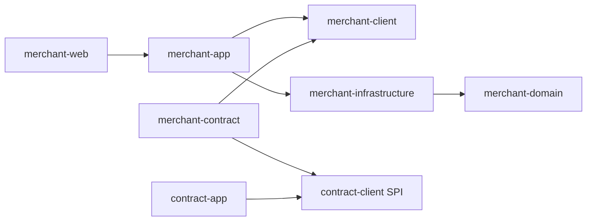

# LoadUp Merchant Architecture

## 职责边界

商户是独立于 UPMS 用户、租户和合约的业务主体。UPMS 管理操作者身份与权限；Merchant 管理商户基本资料；Contract 读取资料判断签约/使用规则并冻结配置。商户 id 为内部身份，merchantCode 为租户内不可变业务编码，不能直接用 UPMS userId 或名称代替。

本轮交付基本资料 CRUD、启停、持久化、管理 API、页面和事实适配。资质核验、入网流程、渠道注册、结算账户、门店、历史资料版本与可靠审计后续按业务需求建设。

## 分层和依赖

client 为 Command/Query/DTO 和 MerchantQueryFacade；domain 为不可变 Merchant/MerchantBasicInfo、枚举与 Gateway，零 Spring/ORM/JSON；infrastructure 为 BaseDO、Mapper、GatewayImpl 和 MapStruct；app 负责事务、身份、时钟、版本及公开查询；web 负责 POST/JSON、权限和 SpringDoc。

可选 merchant-contract 只通过 MerchantQueryFacade 与 MerchantFactsProvider 桥接，不在商户核心引入合约依赖，也不在合约核心引入商户仓储。Bean 缺失时不装配，已有自定义 Provider 优先。

自动配置采用 DataSource 候选条件与显式 Import，转换器为 MapStruct 生成的 Spring Bean。没有组件扫描与 REGISTER_BEAN 条件混用，不手工创建转换器。

## 领域不变量

- 租户内 merchantCode 唯一且创建后不变，名字不作为身份。
- 名称、类型、行业、国家必填；字段长度、控制字符和联系方式在领域构造器校验，HTTP 也有 Bean Validation。
- ACTIVE/INACTIVE 表示业务启停，不表示 KYC/资质核验；创建初始 ACTIVE。
- 更新与状态命令检查 expectedRowVersion，写入条件再次检查，成功递增版本并记录 updatedBy。
- 私有字段 null 保留、空串清空；接口响应掩码不用于持久化。没有物理删除能力。

## 持久化与隔离

merchant_profile 包含 id/tenant_id/created_at/updated_at/deleted 标准列，以及基本资料、status、row_version、创建/更新操作者。唯一键 tenant_id+merchant_code；分页索引 tenant_id+status+created_at。id 由业务 UUID 提供。

Gateway 用 QueryWrapper 明确约束 tenant 与 deleted=0；空租户和空查找 id 拒绝。Mapper 只有 BaseMapper 标准方法。更新整个已合并资料时显式写入 null，以允许清空可选公开字段；敏感字段已在领域更新中保留原值或明确置空串。事务由 app 包围，唯一约束处理并发创建，版本条件防止丢失更新。

迁移 V20261010000001 与合约时间戳编号独立，消费方需验收多模块组合及已有库升级。框架提供的是 SDK，loadup-application 仅作本地集成启动器。

## 合约事实信任边界

MerchantQueryFacade 读取显式租户/id，并要求请求作用域租户一致；事实适配器再次比较返回身份，仅输出基本事实白名单。未维护的地区不输出，未知事实不能靠空串伪装成存在。联系人、登记号和详细地址不进入事实 map。

后台管理员维护的行业可用于普通产品销售限制；不能把人工登记字段当作证件核验或监管资质。需要强资质判断时消费方扩展独立可信 Provider 与审批，仍不能信任浏览器上传的 fact map。

lookup 不使用 readOnly 事务提示，要求权威主库，避免商户停用后因副本滞后继续放行。MerchantFactsProvider 查询发生在合约事务前，不跨模块持锁；在途并发采样无法等同原子停用门禁。合约运行每次读取当前事实；历史条款不因此修改。

## 接口与隐私

`/api/merchants/create/update/page/detail/status`，分别用 merchant:write/read/manage 授权，JSON 全部 POST。租户由框架可信上下文绑定，actor 来自 Authentication。权限只表示租户后台管理资格，面向商户自助时须增加数据归属控制。

DTO 用 Masked 描述 JSON 输出规则，由 WebMVC 独立输出 mapper 脱敏，不修改全局 mapper或领域数据。前端敏感编辑从空白开始，null 保留原值，避免保存掩码。资料存储仍是明文，日志禁止打印 Command/DO 原文；生产需自行设置数据库权限/加密和审计保留。

## 验证与扩展

已编写领域、事实适配与真实 MySQL 合约组合测试，未运行。后续执行 Boot 装配、MapStruct/Jackson3、实际权限、脱敏、前端类型/交互及并发停用边界验收。可靠审计、Outbox、资质审核、历史资料与渠道开户扩展不得覆盖现有合约条款。

## 公共边界与映射约束

Facade 是 client 的业务契约，应用服务直接实现；Controller 和跨模块消费者依赖 Facade。domain 保留业务状态、规则与 Gateway，表示层字段转换交给 Spring 管理的 MapStruct。共享配置固定 Spring 模式、构造器注入和目标字段严格校验。

仓储依赖 database 的固定 UUID、审计时间、逻辑删除规则，由 database processor 自动生成带 @Mapper 的 XxxDOMapper（继承 BaseMapper），并通过模块生成的 Tables 表达查询。字典删除与文件引用解绑明确使用物理删除；文件状态、通知归档和任务生命周期是业务状态，独立于 BaseDO 的 deleted。

所有数据对象的诊断文本使用 commons-json；诊断序列化与真实 API JSON 分离，避免因 HTTP 脱敏设置改变日志中的凭证披露规则。

## Client 入参与分页边界

client.command 表达业务写动作，client.query 表达只读条件；Controller 和 Facade 共用入参契约。模块专用 PageDTO 已移除，app 将领域分页对象映射为 commons-dto 的 PageDTO；Web 输出 PageResponse，避免分页结构随模块变化。领域 Gateway 的分页返回值不携带 HTTP envelope。
