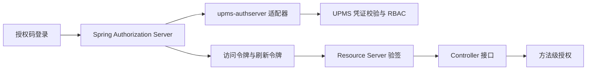

# UPMS 架构

账号安全自助读写由 `AccountSecurityController → AccountSecurityService → UserGateway/LoginLogGateway` 完成。密码修改复用 `UserService.changePassword` 的旧密码校验、编码与持久化；登录记录通过既有 `LoginLogGateway` 按本人 ID 分页读取。HTTP 层只从已验证 JWT 的 `LoadUpUser.userId` 取当前用户，不从请求读取用户 ID。`UpmsTokenController` 将服务端远端 IP 传入认证服务，成功及已知用户名的失败尝试写入登录日志。临时锁定到期后允许在认证时解锁；管理员手动锁定必须手动解除。

## 边界

UPMS 的 `AuthenticationService.login` 选择登录策略、校验账号凭证并记录登录结果，返回 `AuthenticatedUser`，不签发令牌。用户、角色、权限、部门数据仍由 UPMS 的 client/domain/infrastructure/app 分层管理。`loadup-modules-upms-authserver` 是可选适配器：`UpmsAuthenticationProvider` 使用 UPMS 登录接口，随后读取角色和权限；`UpmsTokenController` 为前端提供 `/api/auth/login` JSON 接口并签发用户 JWT。

`loadup-components-authserver-binder-sas` 管理签名密钥和 JwtEncoder；启用 OAuth2 协议端点时也管理客户端、授权码和刷新令牌。JWT 的 `sub` 是 UPMS 用户 ID；`roles`、`permissions`、`username`、`aud` 与 `token_use` 在签发时写入。资源端由独立 `loadup-components-resource-server` 校验。关闭协议端点时，资源端直接用本地公钥验签。

## 依赖方向

UPMS 领域对象、对外 DTO 和持久化对象的审计时间统一为 `createdAt`、`updatedAt`；数据库列为 `created_at`、`updated_at`，与框架 `BaseDO` 一致。

- UPMS 核心模块依赖 commons/components，不依赖 SAS 实现；可选 `upms-web` 提供 Controller。
- `loadup-modules-upms-authserver` 依赖 UPMS app 与 AuthServer API，允许应用按需引入。
- 资源服务器认证和业务授权直接作用于 Controller；外部 API 调用由未来独立的 HTTP 客户端组件承担。
- `loadup-components-authorization` 提供 `@PreAuthorize` 方法安全和 `UserContext`，不注册 HTTP 放行链。

## RBAC 与 ABAC

- **client**：`AccessCheckCommand` 和 `AccessDecisionDTO` 是跨模块契约；用户详情只保留 client 的 `UserDetailDTO`，角色/用户查询条件位于 client.query。
- **domain**：`UserPermissionService` 计算有效角色及其继承权限；`AccessDecisionService` 先核对角色授权，再按授予角色的 `DataScope` 检查资源所属人或部门。继承的权限使用授予该权限的角色的数据范围，循环角色链按已访问 ID 截断。
- **infrastructure**：`upms_user_role`、`upms_role_permission`、`upms_role_department` 是关系存储，Mapper 由 MyBatis-Flex 生成；仓储实现不承载授权决策。
- **app**：`AccessCheckService` 将 client 请求映射为领域资源属性。登录凭证、登录方式和 OAuth 提供商模型属于应用内部策略，不暴露在 client。Web 适配不公开可代填任意 userId 的判定端点，调用方须从可信身份上下文获取 userId。

数据范围编码：`1` 全部、`2` 自定义部门、`3` 本部门、`4` 本部门及下级、`5` 仅本人。范围判定所需的所属人或部门属性缺失、未知范围、无有效权限或停用用户均拒绝；“全部”范围无需所属人和部门属性。多个有效角色采用“任一完整授权放行”。该 ABAC 切片只覆盖组织与所属人属性，没有通用表达式策略或环境属性规则；这些能力需具体用例再扩展。

## 运行约束

UPMS 应用密码编码器支持新写入的 `{bcrypt}` 和已有的 BCrypt 哈希。SAS 客户端密钥经 BCrypt 编码。生产环境需配置持久 RSA 私钥；不配置时的临时私钥仅适于本地开发。资源端应使用固定 issuer、audience 和可信 JWK，公开 API 路径由 `permit-all` 明确声明。

当前刷新令牌沿用授权时保存的用户主体，角色和权限是签发时快照；需要撤销后立即生效的部署，应缩短访问令牌有效期，并在上线前实现刷新阶段的 UPMS 重新校验及授权撤销存储。

## 敏感字段与明文访问边界

`upms-client` 输出 `UserDetailDTO` 声明 `@Masked`；domain/DO/Command 不声明展示规则。`upms-app` 的 `UserSensitiveReadService` 校验调用者和请求、读取租户范围内目标、执行 `AccessDecisionService`、调用 `SensitiveReadAudit`，最后才经 Spring MapStruct `UserSensitiveConverter` 构造不带脱敏注解的 `UserSensitiveDTO`。

`upms-web` 的独立 Controller 从认证主体取得 actor，不接受客户端指定调用者；静态方法授权与 app 中最新角色/资源范围校验同时存在。purpose 为枚举，audit SPI 不接受任何敏感原文。审计模块是 web 的 optional 依赖，app/domain 无 audit 横向依赖；默认桥接仅在 AuditService 存在时装配，并以 REQUIRES_NEW 事务确保成功提交后才能返回。缺少 recorder 时普通查询继续可用，明文请求失败。

普通输出不因角色权限变成明文；明文 DTO 的 toString 只输出 ID，且响应不可缓存。调用方仍须避免记录 HTTP body、DTO JSON 或敏感字段异常。首版未提供通用明文导出，导出处理器须显式执行展示脱敏。

## 公共边界与映射约束

Facade 是 client 的业务契约，应用服务直接实现；Controller 和跨模块消费者依赖 Facade。domain 保留业务状态、规则与 Gateway，表示层字段转换交给 Spring 管理的 MapStruct。共享配置固定 Spring 模式、构造器注入和目标字段严格校验。

仓储依赖 database 的固定 UUID、审计时间、逻辑删除规则，显式声明空 BaseMapper，并通过模块生成的 Tables 表达查询。字典删除与文件引用解绑明确使用物理删除；文件状态、通知归档和任务生命周期是业务状态，独立于 BaseDO 的 deleted。

所有数据对象的诊断文本使用 commons-json；诊断序列化与真实 API JSON 分离，避免因 HTTP 脱敏设置改变日志中的凭证披露规则。

## Client 入参与分页边界

client.command 表达业务写动作，client.query 表达只读条件；Controller 和 Facade 共用入参契约。模块专用 PageDTO 已移除，app 将领域分页对象映射为 commons-dto 的 PageDTO；Web 输出 PageResponse，避免分页结构随模块变化。领域 Gateway 的分页返回值不携带 HTTP envelope。
