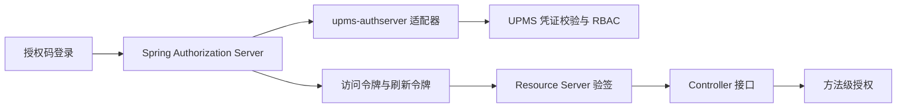

# UPMS 架构

## 边界

UPMS 的 `AuthenticationService.login` 选择登录策略、校验账号凭证并记录登录结果，返回 `AuthenticatedUser`，不签发令牌。用户、角色、权限、部门数据仍由 UPMS 的 client/domain/infrastructure/app 分层管理。`loadup-modules-upms-authserver` 是可选适配器：`UpmsAuthenticationProvider` 使用 UPMS 登录接口，随后读取角色和权限；`UpmsTokenController` 为前端提供 `/api/auth/login` JSON 接口并签发用户 JWT。

`loadup-components-authserver-binder-sas` 管理签名密钥和 JwtEncoder；启用 OAuth2 协议端点时也管理客户端、授权码和刷新令牌。JWT 的 `sub` 是 UPMS 用户 ID；`roles`、`permissions`、`username`、`aud` 与 `token_use` 在签发时写入。资源端由独立 `loadup-components-resource-server` 校验。关闭协议端点时，资源端直接用本地公钥验签。

## 依赖方向

UPMS 领域对象、对外 DTO 和持久化对象的审计时间统一为 `createdAt`、`updatedAt`；数据库列为 `created_at`、`updated_at`，与框架 `BaseDO` 一致。

- UPMS 核心模块依赖 commons/components，不依赖 SAS 实现；可选 `upms-web` 提供 Controller。
- `loadup-modules-upms-authserver` 依赖 UPMS app 与 AuthServer API，允许应用按需引入。
- 资源服务器认证和业务授权直接作用于 Controller；外部 API 调用由未来独立的 HTTP 客户端组件承担。
- `loadup-components-authorization` 提供 `@PreAuthorize` 方法安全和 `UserContext`，不注册 HTTP 放行链。

## RBAC 与 ABAC

- **client**：`AccessCheckCommand` 和 `AccessDecisionDTO` 是跨模块契约；用户详情只保留 client 的 `UserDetailDTO`，角色/用户查询条件位于 client.query。
- **domain**：`UserPermissionService` 计算有效角色及其继承权限；`AccessDecisionService` 先核对角色授权，再按授予角色的 `DataScope` 检查资源所属人或部门。继承的权限使用授予该权限的角色的数据范围，循环角色链按已访问 ID 截断。
- **infrastructure**：`upms_user_role`、`upms_role_permission`、`upms_role_department` 是关系存储，Mapper 由 MyBatis-Flex 生成；仓储实现不承载授权决策。
- **app**：`AccessCheckServiceImpl` 将 client 请求映射为领域资源属性。登录凭证、登录方式和 OAuth 提供商模型属于应用内部策略，不暴露在 client。Web 适配不公开可代填任意 userId 的判定端点，调用方须从可信身份上下文获取 userId。

数据范围编码：`1` 全部、`2` 自定义部门、`3` 本部门、`4` 本部门及下级、`5` 仅本人。范围判定所需的所属人或部门属性缺失、未知范围、无有效权限或停用用户均拒绝；“全部”范围无需所属人和部门属性。多个有效角色采用“任一完整授权放行”。该 ABAC 切片只覆盖组织与所属人属性，没有通用表达式策略或环境属性规则；这些能力需具体用例再扩展。

## 运行约束

UPMS 应用密码编码器支持新写入的 `{bcrypt}` 和已有的 BCrypt 哈希。SAS 客户端密钥经 BCrypt 编码。生产环境需配置持久 RSA 私钥；不配置时的临时私钥仅适于本地开发。资源端应使用固定 issuer、audience 和可信 JWK，公开 API 路径由 `permit-all` 明确声明。

当前刷新令牌沿用授权时保存的用户主体，角色和权限是签发时快照；需要撤销后立即生效的部署，应缩短访问令牌有效期，并在上线前实现刷新阶段的 UPMS 重新校验及授权撤销存储。
