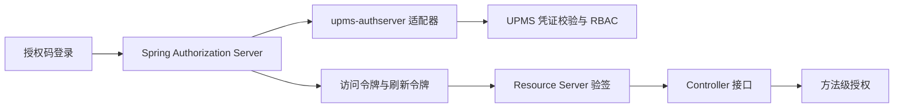

# UPMS 架构

## 边界

UPMS 的 `AuthenticationService.login` 选择登录策略、校验账号凭证并记录登录结果，返回 `AuthenticatedUser`，不签发令牌。用户、角色、权限、部门数据仍由 UPMS 的 client/domain/infrastructure/app 分层管理。`loadup-modules-upms-authserver` 是可选适配器：`UpmsAuthenticationProvider` 使用 UPMS 登录接口，随后读取角色和权限，构造 SAS 可识别的用户主体。此模块只接入授权码登录流程，不创建令牌接口。

`loadup-components-authserver-binder-sas` 管理 OAuth2 客户端、授权码、访问令牌、刷新令牌和 JWK。JWT 的 `sub` 是 UPMS 用户 ID；`roles`、`permissions`、`username`、`aud` 与 `token_use` 在签发时写入。资源端由独立 `loadup-components-resource-server` 校验。外部身份提供商可以直接与 Resource Server 对接；UPMS 不依赖其签发器。

## 依赖方向

- UPMS 核心模块依赖 commons/components，不依赖 Gateway 或 SAS 实现；可选 `upms-web` 提供 Controller。
- `loadup-modules-upms-authserver` 依赖 UPMS app 与 AuthServer API，允许应用按需引入。
- 资源服务器认证和业务授权直接作用于 Controller；外部 API 调用由未来独立的 HTTP 客户端组件承担。
- `loadup-components-authorization` 提供 `@PreAuthorize` 方法安全和 `UserContext`，不注册 HTTP 放行链。

## 运行约束

UPMS 应用密码编码器支持新写入的 `{bcrypt}` 和已有的 BCrypt 哈希。SAS 客户端密钥经 BCrypt 编码。生产环境需配置持久 RSA 私钥；不配置时的临时私钥仅适于本地开发。资源端应使用固定 issuer、audience 和可信 JWK，公开 API 路径由 `permit-all` 明确声明。

当前刷新令牌沿用授权时保存的用户主体，角色和权限是签发时快照；需要撤销后立即生效的部署，应缩短访问令牌有效期，并在上线前实现刷新阶段的 UPMS 重新校验及授权撤销存储。
