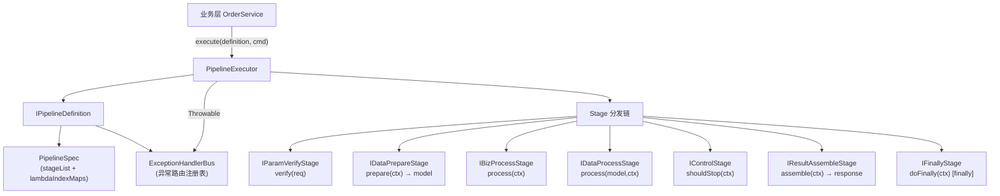
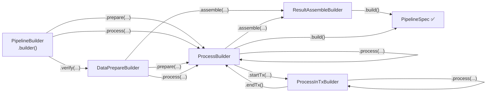

# LoadUp Pipeline 流程编排组件

基于 Spring Boot 3 的**流程编排组件**，将业务逻辑拆分为 `验参 → 准备 → 处理 → 组装` 四个固定阶段，通过类型安全的 Fluent DSL 声明式地定义和执行流程。

## 核心特性

- 🔗 **四阶段标准流程** — verify → prepare → process → assemble，职责清晰
- 🔒 **类型安全 DSL** — 链式 Builder，编译期保证阶段顺序正确
- 🎛️ **两种 Stage 写法** — Spring Bean 类 / Lambda 内联函数
- 🛑 **控制流** — `IControlStage` 支持条件性提前结束流程
- 🔁 **Finally 阶段** — `IFinallyStage` 保证清理逻辑必然执行
- 🚨 **类型化异常路由** — `ExceptionHandlerBus` 按异常类型精确分发，支持 overflow / bottom 降级
- 💾 **Spring 事务集成** — `startTx / endTx` 包裹任意阶段
- ✅ **零私有依赖** — 纯 Spring 原生，无云厂商 SDK

---

## 整体架构



---

## 快速开始

### 1. 添加依赖

```xml
<dependency>
    <groupId>io.github.loadup-cloud</groupId>
    <artifactId>loadup-components-pipeline</artifactId>
</dependency>
```

### 2. 定义 Stage

```java
// 参数校验
@Component
public class CreateOrderVerifyStage implements IParamVerifyStage<CreateOrderCmd> {
    @Override
    public void verify(CreateOrderCmd cmd) {
        Assert.hasText(cmd.getUserId(), "userId 不能为空");
        Assert.notEmpty(cmd.getItems(), "订单商品不能为空");
    }
}

// 数据准备 — 加载领域模型
@Component
public class CreateOrderPrepareStage implements IDataPrepareStage<OrderDO> {
    @Override
    public OrderDO prepare(PipelineContext ctx) {
        CreateOrderCmd cmd = ctx.getRequest(CreateOrderCmd.class);
        return OrderDO.create(cmd.getUserId(), cmd.getItems());
    }
}

// 业务处理 — 持久化
@Component
public class CreateOrderProcessStage implements IBizProcessStage {
    private final OrderGateway gateway;

    @Override
    public void process(PipelineContext ctx) {
        gateway.save(ctx.getModel(OrderDO.class));
    }
}

// 结果组装 — DO → DTO
@Component
public class CreateOrderAssembleStage implements IResultAssembleStage<OrderDTO> {
    @Override
    public OrderDTO assemble(PipelineContext ctx) {
        return OrderConverter.toDTO(ctx.getModel(OrderDO.class));
    }
}
```

### 3. 定义 Pipeline

```java
@Service
public class CreateOrderPipelineDefinition implements IPipelineDefinition {

    @Override
    public PipelineSpec definePipeline() {
        return PipelineBuilder.builder()
            .verify(CreateOrderVerifyStage.class)
            .prepare(CreateOrderPrepareStage.class)
            .process(CreateOrderProcessStage.class)
            .assemble(CreateOrderAssembleStage.class)
            .build();
    }

    @Override
    public ExceptionHandlerBus exceptions() {
        return ExceptionHandlerBus.builder()
            .register(BizException.class, OrderBizExceptionHandler.class)
            .bottom(OrderSystemExceptionHandler.class);
    }
}
```

### 4. 执行

```java
@Service
@RequiredArgsConstructor
public class OrderService {

    private final PipelineExecutor pipelineExecutor;
    private final CreateOrderPipelineDefinition createOrderPipeline;

    public OrderDTO createOrder(CreateOrderCmd cmd) {
        return pipelineExecutor.execute(createOrderPipeline, cmd);
    }
}
```

---

## Lambda 内联写法

无需创建 Stage Bean，直接内联逻辑：

```java
@Override
public PipelineSpec definePipeline() {
    return PipelineBuilder.builder()
        .<CreateOrderCmd>verify(cmd ->
            Assert.hasText(cmd.getUserId(), "userId 不能为空"))
        .<OrderDO>prepare(ctx ->
            OrderDO.create(ctx.getRequest(CreateOrderCmd.class)))
        .process((PipelineContext ctx) ->
            gateway.save(ctx.getModel(OrderDO.class)))
        .<OrderDTO>assemble(ctx ->
            OrderConverter.toDTO(ctx.getModel(OrderDO.class)))
        .build();
}
```

---

## 事务支持

用 `startTx / endTx` 包裹需要在同一事务中执行的阶段：

```java
PipelineBuilder.builder()
    .verify(VerifyStage.class)
    .prepare(PrepareStage.class)
    .startTx(DefaultSpringTxInitializer.class)   // ── 开启 Spring 事务
        .process(SaveOrderStage.class)
        .process(SaveInventoryStage.class)
    .endTx()                                      // ── 提交 / 回滚
    .assemble(AssembleStage.class)
    .build();
```

!!! info "事务机制"
    Executor 使用 `PlatformTransactionManager` + `TransactionTemplate`。TX 块内任意 `RuntimeException` 自动触发回滚。

---

## 异常处理

### 定义 Handler

```java
@Component
public class OrderBizExceptionHandler implements IExceptionClassHandler<OrderDTO> {

    @Override
    public void handleException(Throwable t, PipelineContext ctx) {
        log.warn("[Order] 业务异常: {}", t.getMessage());
    }

    @Override
    public OrderDTO assembleResultOnException(Throwable t, PipelineContext ctx) {
        return OrderDTO.fail(t.getMessage());
    }
}
```

### 异常路由优先级

```
catch(Throwable t):
  1. overflow 集合包含此异常类？  →  直接 rethrow（穿透所有 Handler）
  2. 精确匹配注册的异常类          →  调用对应 Handler
  3. 父类匹配                     →  调用对应 Handler
  4. bottom Handler               →  兜底 Handler
  5. 无任何 Handler               →  sneakyThrow
```

---

## Stage 类型速查

| 接口 | 方法 | 场景 |
|------|------|------|
| `IParamVerifyStage<REQ>` | `void verify(REQ req)` | 参数校验，抛异常即失败 |
| `IDataPrepareStage<DATA>` | `DATA prepare(ctx)` | 加载领域模型 |
| `IBizProcessStage` | `void process(ctx)` | 纯业务逻辑，无需模型引用 |
| `IDataProcessStage<DATA>` | `void process(model, ctx)` | 对模型做变换/写操作 |
| `IResultAssembleStage<RES>` | `RES assemble(ctx)` | DO → DTO 映射 |
| `IControlStage` | `boolean shouldStop(ctx)` | 条件性终止流程 |
| `IFinallyStage` | `void doFinally(ctx)` | 清理逻辑，必然执行 |

---

## Builder 链类型安全



---

## 与 Extension 组件配合

Pipeline 负责**流程顺序**，Extension 负责**实现路由**，两者正交互补：

```java
// 在 Stage 内部通过 ExtensionExecutor 路由到正确的策略实现
@Component
@RequiredArgsConstructor
public class CalculatePriceStage implements IBizProcessStage {

    private final ExtensionExecutor extensionExecutor;

    @Override
    public void process(PipelineContext ctx) {
        // BizContextHolder 已由 @BizScenario AOP 拦截器自动注入
        BigDecimal price = extensionExecutor.execute(
            IPriceStrategy.class,
            strategy -> strategy.calculate(ctx.getModel(OrderDO.class))
        );
        ctx.putProperty("calculatedPrice", price);
    }
}
```

| 组件 | 解决的问题 | 使用场景 |
|------|-----------|---------|
| **Pipeline** | 流程顺序编排，消除大方法 | 一个业务操作对应一套固定步骤 |
| **Extension** | 实现路由，消除 if-else | 同一步骤按 bizCode 有多种实现 |

---

## 包结构

```
io.github.loadup.components.pipeline
├── api/              Stage SPI 接口 + IPipelineDefinition
├── builder/          Fluent DSL 构建器链
├── config/           PipelineAutoConfiguration
├── context/          PipelineContext（跨阶段共享状态）
├── engine/           PipelineExecutor（核心执行引擎）
├── exception/        ExceptionHandlerBus + Handler SPI
├── selector/         IPipelineSelector（运行时 Pipeline 路由）
├── spec/             PipelineSpec（不可变流程描述）
├── stage/function/   InnerXxxStage Lambda 适配器
└── tx/               ITxInitializer、EndTxMarker、DefaultSpringTxInitializer
```

---

## 相关文档

- [Extension 扩展点框架](extension.md) — 与 Pipeline 配合使用的实现路由组件
- [架构设计](../architecture.md) — 整体架构概览

