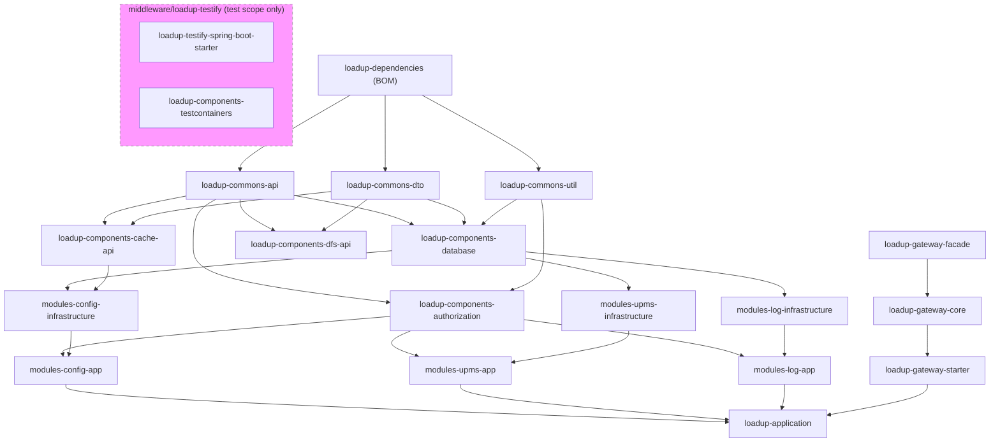
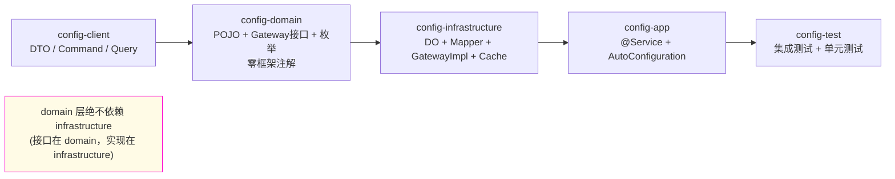

# LoadUp 模块依赖图谱

本文档描述 LoadUp Monorepo 中所有模块之间的依赖关系，帮助开发者快速理解：
- 允许依赖的方向（单向）
- 横向依赖的风险识别
- 新增模块时应依赖什么、不应依赖什么

---

## 一、宏观依赖方向（Mermaid）



> ⚠️ 图中未展示 client / domain 子层以保持可读性，详见下方"模块内部分层"章节。

---

## 二、各层允许依赖矩阵

| 依赖方（行） \ 被依赖方（列） | dependencies | commons | components | modules | application | middleware/gateway | middleware/testify |
|----|:---:|:---:|:---:|:---:|:---:|:---:|:---:|
| commons | ✅ | — | ❌ | ❌ | ❌ | ❌ | ❌ |
| components | ✅ | ✅ | 部分¹ | ❌ | ❌ | ❌ | test² |
| modules | ✅ | ✅ | ✅ | 不推荐³ | ❌ | ❌ | test² |
| application | ✅ | ✅ | ✅ | ✅ | — | ✅ | test² |
| middleware/gateway | ✅ | ✅ | ✅ | ❌ | ❌ | — | ❌ |
| middleware/testify | ✅ | ✅ | ✅ | ❌ | ❌ | ❌ | — |

**注：**
1. `components` 内部可互相依赖（仅 api 层），不得循环依赖
2. `testify` 仅在 `<scope>test</scope>` 下引用
3. modules 之间可通过 `client` 层传递 DTO（只读），但禁止直接调用另一模块的 Service/Gateway

---

## 三、业务模块内部分层依赖

每个 `loadup-modules-{mod}` 的 5 个子模块依赖方向如下（以 config 模块为例）：



**铁律**：
- `domain` 是纯 POJO，**无** `@Table`、**无** `@Service`、**无** 任何 Spring/ORM 注解
- `infrastructure` 实现 `domain.gateway` 接口
- `app` 只通过 `domain.gateway` 接口操作数据库，**不直接引用 Mapper**

---

## 四、当前各模块快速参考表

### 4.1 commons 层

| 模块 | artifactId | 职责 | 对外暴露 |
|------|-----------|------|---------|
| commons-api | `loadup-commons-api` | 通用接口、常量、注解 | 全部 |
| commons-dto | `loadup-commons-dto` | `Result<T>`、`PageDTO`、通用 DTO | 全部 |
| commons-util | `loadup-commons-util` | StringUtils、DateUtils、加密工具等 | 全部 |

### 4.2 components 层

| 模块 | artifactId | 职责 | 关键依赖项 |
|------|-----------|------|-----------|
| database | `loadup-components-database` | MyBatis-Flex 配置、`BaseDO`、审计、多租户 | MyBatis-Flex |
| cache-api | `loadup-components-cache-api` | 缓存抽象接口 `CacheService` | 无框架依赖 |
| cache-caffeine | `loadup-components-cache-binder-caffeine` | Caffeine 本地缓存实现 | caffeine |
| cache-redis | `loadup-components-cache-binder-redis` | Redisson 分布式缓存实现 | redisson |
| authorization | `loadup-components-authorization` | `@RequirePermission` 方法鉴权 | Spring AOP |
| dfs-api | `loadup-components-dfs-api` | 文件存储抽象 | 无框架依赖 |
| dfs-database | `loadup-components-dfs-binder-database` | 数据库存储实现 | database |
| flyway | `loadup-components-flyway` | Flyway 集成封装 | flyway-core |
| globalunique | `loadup-components-globalunique` | 基于数据库唯一键的幂等控制 | database |
| gotone | `loadup-components-gotone` | 统一消息通知（Email/SMS/Push） | — |
| retrytask | `loadup-components-retrytask` | 分布式重试任务框架 | database |
| scheduler | `loadup-components-scheduler-*` | 任务调度（SimpleJob/Quartz） | — |
| signature | `loadup-components-signature` | 数字签名（RSA/DSA/MD5） | — |
| testcontainers | `loadup-components-testcontainers` | 测试容器封装（test scope） | testcontainers |
| tracer | `loadup-components-tracer` | OpenTelemetry 链路追踪 | otel |

### 4.3 modules 层

| 模块 | 说明 | 依赖的 components |
|------|------|------------------|
| `loadup-modules-upms` | 用户权限管理（RBAC3、JWT、OAuth2） | database, authorization |
| `loadup-modules-config` | 系统参数 + 数据字典管理 | database, cache-api, authorization |
| `loadup-modules-log` | 操作日志记录（AOP 拦截） | database, authorization |

### 4.4 middleware/gateway

| 子模块 | 职责 |
|--------|------|
| `loadup-gateway-facade` | 模型、SPI 接口、配置属性 |
| `loadup-gateway-core` | 路由解析、Action 责任链、插件体系 |
| `loadup-gateway-starter` | AutoConfiguration，聚合装配 |
| `loadup-gateway-repository-file-plugin` | 基于 YAML 文件的路由存储插件 |
| `loadup-gateway-proxy-springbean-plugin` | `bean://` 协议代理插件 |
| `loadup-gateway-proxy-http-plugin` | `http://` 协议反向代理插件 |

---

## 五、横向依赖风险识别

### 5.1 常见违规模式

| 违规模式 | 风险 | 检测命令 |
|---------|------|---------|
| `modules-A-app` 依赖 `modules-B-app` | 循环依赖、耦合升级蔓延 | `mvn dependency:tree -pl modules/loadup-modules-A/loadup-modules-A-app` |
| `modules-A-domain` 引入 Spring Bean | domain 污染，测试困难 | `grep -r "@Service\|@Component\|@Repository" modules/*/loadup-modules-*-domain/src` |
| `modules-A-infrastructure` 直接调用 `modules-B-infrastructure` | 跳层，绕过 Gateway 抽象 | `mvn dependency:analyze -pl modules/loadup-modules-A/loadup-modules-A-infrastructure` |
| `components` 依赖 `modules` | 反向依赖，破坏层次 | `mvn dependency:tree -pl components/loadup-components-xxx` |

### 5.2 ArchUnit 自动检测（架构约束测试）

`loadup-application` 包含 ArchUnit 测试，编译时自动检查：

```java
// 架构约束测试示例（loadup-application/src/test）
ArchRule rule = noClasses()
    .that().resideInAPackage("..modules..")
    .should().dependOnClassesThat()
    .resideInAPackage("..gateway..");
```

执行：`mvn test -pl loadup-application`

### 5.3 手动依赖树命令

```bash
# 查看某模块完整依赖树
mvn dependency:tree -pl modules/loadup-modules-config/loadup-modules-config-app

# 查找是否有某个 artifact 被意外引入
mvn dependency:tree -pl modules/loadup-modules-upms/loadup-modules-upms-infrastructure \
    -Dincludes=io.github.loadup-cloud:loadup-modules-config-domain

# 全量分析（输出到文件）
mvn dependency:tree > /tmp/dep-tree.txt
```

---

## 六、新增模块时的 Checklist

新增 `loadup-modules-xxx` 时，需要同步更新：

- [ ] `loadup-dependencies/pom.xml` 中加入所有 5 个子模块的 `<dependencyManagement>` 条目
- [ ] 根 `pom.xml` 的 `<modules>` 加入 `modules/loadup-modules-xxx`
- [ ] `loadup-application/pom.xml` 中引入 `loadup-modules-xxx-app`
- [ ] 本文件（module-dependency-map.md）的 **4.3 节**更新模块表
- [ ] `mkdocs/docs/component-integration-quick-ref.md` 如有新组件使用需同步
- [ ] `loadup-application/src/main/resources/application.yml` 注册 Gateway 路由

---

## 七、依赖图维护说明

本文档应随每次以下变更同步更新：

| 变更类型 | 需更新的章节 |
|---------|------------|
| 新增业务模块 | 四（2/3）、六 |
| 新增 component | 四（2）|
| 跨模块新增依赖 | 二、三、五 |
| 模块拆分/合并 | 二、三、四 |

> 建议将"更新 module-dependency-map.md"作为 PR 模板中新增模块/跨模块依赖变更的必选检查项。
